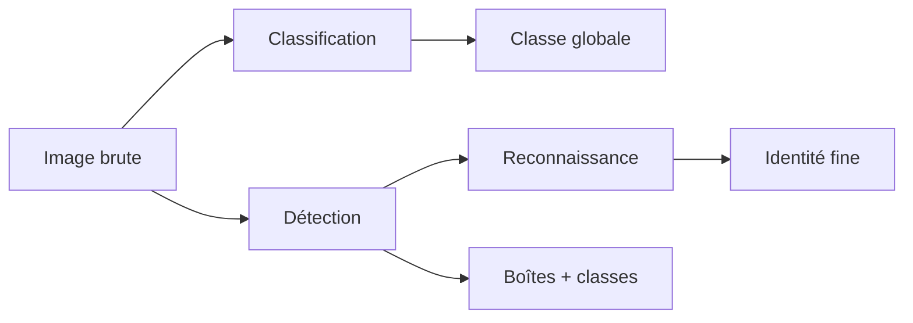
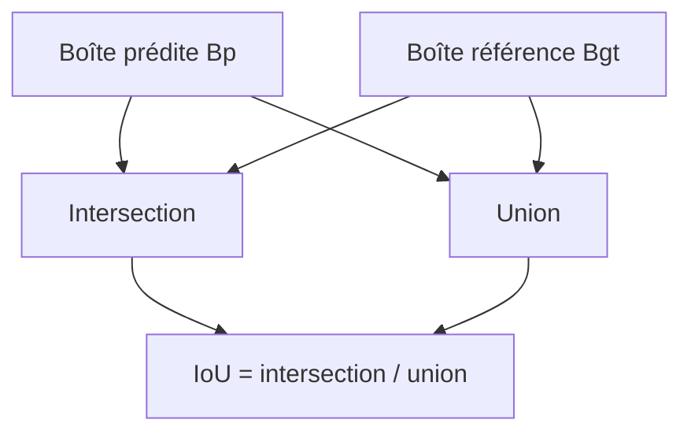
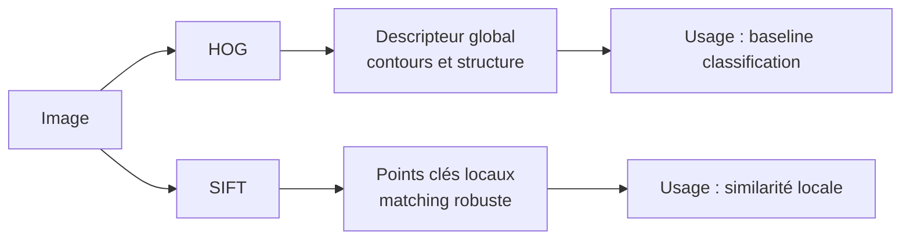
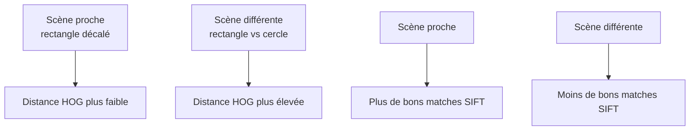

# Jour 1 — Fondamentaux de vision par ordinateur et descripteurs classiques

## 1. Objectifs d'apprentissage

- Distinguer sans ambiguïté les tâches de classification, de détection et de reconnaissance.
- Comprendre la chaîne complète d'un pipeline de vision, de l'acquisition à l'interprétation métier.
- Maîtriser les opérations de base avec OpenCV : conversion, seuillage, extraction de région et visualisation.
- Étudier deux familles de descripteurs classiques (HOG et SIFT) et savoir les comparer sur des cas concrets.
- Produire des résultats reproductibles, mesurables et exploitables dans un contexte professionnel.

## 2. Positionnement dans le syllabus

Le contenu de ce chapitre couvre intégralement les deux blocs du Jour 1 :

- Bloc A (3 h 30) : introduction à la vision par ordinateur.
- Bloc B (3 h 30) : description d'images par descripteurs.

## 3. Introduction

Ce premier chapitre constitue le socle méthodologique du module. Avant d'utiliser des réseaux de neurones, il est indispensable de savoir :

- formuler correctement le problème,
- préparer les données visuelles,
- choisir des représentations pertinentes,
- mesurer la qualité des résultats avec des indicateurs explicites.

La logique de travail attendue est la suivante :

1. définir l'objectif,
2. transformer l'image pour extraire une information utile,
3. calculer des mesures,
4. interpréter les résultats selon des critères métier explicites.

## 4. Prérequis

- Python 3.
- Bases sur les tableaux `numpy`.
- Notions de base sur les pixels, les canaux et les niveaux de gris.
- Bibliothèques installées : OpenCV, NumPy, Matplotlib.

## 5. Concepts fondamentaux

### 5.1 Classification

- Entrée : image complète.
- Sortie : une classe globale.
- Question métier typique : « Quel type d'objet est présent dans l'image ? »

### 5.2 Détection

- Entrée : image complète.
- Sortie : boîtes englobantes + classes + scores.
- Question métier typique : « Où se trouvent les objets et de quelle catégorie sont-ils ? »

### 5.3 Reconnaissance

- Entrée : objet ou région déjà localisée.
- Sortie : identité fine (personne, produit, logo, référence).
- Question métier typique : « Quel objet précis est observé ? »

### 5.4 Schéma de positionnement des tâches



### 5.5 Pipeline de vision de bout en bout


### 5.6 Cas d'usage concrets

#### Cas 1 — Contrôle qualité industriel

- Problème : vérifier la présence et la position d'un composant.
- Attendu : localisation fiable de la zone d'intérêt.
- Mesure clé : IoU entre boîte prédite et boîte de référence.

#### Cas 2 — Commerce de détail

- Problème : compter et identifier des produits en rayon.
- Attendu : boîtes cohérentes + classe correcte par produit.
- Mesures clés : précision/rappel de détection, erreurs de confusion.

#### Cas 3 — Vidéo routière

- Problème : détecter piétons et véhicules en flux.
- Attendu : bon compromis qualité/vitesse.
- Mesures clés : rappel, précision, latence par image.

## 6. Fondements mathématiques

### 6.1 Contexte

Deux besoins distincts apparaissent dès le Jour 1 :

- évaluer la qualité de localisation,
- évaluer la similarité visuelle entre représentations.

### 6.2 Symboles et notations

- $B_p$ : boîte prédite.
- $B_{gt}$ : boîte de référence.
- $A_{inter}$ : aire d'intersection.
- $A_{union}$ : aire d'union.
- $\mathbf{x}, \mathbf{y}$ : vecteurs de descripteurs.
- $x_i, y_i$ : composantes des vecteurs.
- $n$ : dimension descripteur.

### 6.3 Formules

Intersection over Union :

$$
IoU = \frac{|B_p \cap B_{gt}|}{|B_p \cup B_{gt}|}
$$

Distance euclidienne entre descripteurs :

$$
d(\mathbf{x}, \mathbf{y}) = \sqrt{\sum_{i=1}^{n}(x_i - y_i)^2}
$$

### 6.4 Lecture mathématique

- L'IoU est un rapport d'aires normalisé entre 0 et 1.
- La distance euclidienne quantifie un écart géométrique dans l'espace des caractéristiques.

### 6.5 Lecture opérationnelle

- IoU élevé : bonne localisation.
- Distance faible : forte similarité de représentation.

### 6.6 Sens métier

- L'IoU répond à « la détection est-elle bien placée ? »
- La distance répond à « les deux objets sont-ils visuellement proches ? »

### 6.7 Décomposition pas à pas de l'IoU

$$
\text{Étape 1 : } A_{inter} = |B_p \cap B_{gt}|
$$

$$
\text{Étape 2 : } A_{union} = |B_p| + |B_{gt}| - A_{inter}
$$

$$
\text{Étape 3 : } IoU = \frac{A_{inter}}{A_{union}}
$$

### 6.8 Exemple numérique

Avec $|B_p|=1200$, $|B_{gt}|=1000$, $A_{inter}=800$ :

$$
A_{union}=1200+1000-800=1400
$$

$$
IoU=\frac{800}{1400}\approx0.571
$$

### 6.9 Interprétation du résultat

- $IoU \approx 0.57$ : acceptable dans un scénario souple.
- En contrôle strict, un seuil de $0.7$ peut être imposé.

### 6.10 Schéma visuel de l'IoU



## 7. HOG et SIFT

### 7.1 HOG

HOG (Histogram of Oriented Gradients) résume globalement la structure de contours d'une fenêtre image.

Points importants :

- sensible à la géométrie globale,
- robuste pour des formes contrastées,
- souvent utilisé comme référence de départ en vision classique.

### 7.2 SIFT

SIFT extrait des points clés locaux et un descripteur autour de chaque point.

Points importants :

- robuste aux changements d'échelle et de rotation,
- adapté au matching local,
- utile en reconnaissance d'objets et appariement d'images.

### 7.3 Comparaison visuelle HOG vs SIFT





## 8. Exemple Python minimal

Cet exemple est volontairement minimal et se concentre sur le calcul de l'IoU.
Le script principal complet du chapitre reste `labs/jour1/day1_lab.py`.

```python
# Exécution
# python3 labs/jour1/day1_lab.py

import json
from pathlib import Path

import cv2
import numpy as np


def make_synthetic_scene(shape: str, shift: int = 0) -> np.ndarray:
    img = np.zeros((256, 256, 3), dtype=np.uint8)
    if shape == "rectangle":
        cv2.rectangle(img, (40 + shift, 60), (180 + shift, 190), (255, 255, 255), -1)
    elif shape == "circle":
        cv2.circle(img, (120 + shift, 130), 60, (255, 255, 255), -1)
    else:
        raise ValueError("shape must be 'rectangle' or 'circle'")
    return img


def iou(box_a, box_b):
    x_left = max(box_a[0], box_b[0])
    y_top = max(box_a[1], box_b[1])
    x_right = min(box_a[2], box_b[2])
    y_bottom = min(box_a[3], box_b[3])
    if x_right <= x_left or y_bottom <= y_top:
        return 0.0
    inter = (x_right - x_left) * (y_bottom - y_top)
    area_a = (box_a[2] - box_a[0]) * (box_a[3] - box_a[1])
    area_b = (box_b[2] - box_b[0]) * (box_b[3] - box_b[1])
    return inter / (area_a + area_b - inter)


def bbox_from_threshold(gray):
    _, th = cv2.threshold(gray, 127, 255, cv2.THRESH_BINARY)
    points = cv2.findNonZero(th)
    x, y, w, h = cv2.boundingRect(points)
    return (x, y, x + w, y + h)


img_gt = make_synthetic_scene("rectangle", 0)
img_pred = make_synthetic_scene("rectangle", 12)

gray_gt = cv2.cvtColor(img_gt, cv2.COLOR_BGR2GRAY)
gray_pred = cv2.cvtColor(img_pred, cv2.COLOR_BGR2GRAY)

box_gt = bbox_from_threshold(gray_gt)
box_pred = bbox_from_threshold(gray_pred)

metrics = {"iou_score": float(iou(box_pred, box_gt))}
Path("outputs/jour1").mkdir(parents=True, exist_ok=True)
Path("outputs/jour1/metrics_minimal.json").write_text(json.dumps(metrics, indent=2), encoding="utf-8")
print(json.dumps(metrics, indent=2))
```

## 9. Explication détaillée du code

- `make_synthetic_scene` génère des scènes contrôlées pour tester la robustesse.
- `bbox_from_threshold` transforme une segmentation binaire en boîte englobante.
- `iou` mesure la qualité de localisation de manière normalisée.
- Le fichier `metrics_minimal.json` assure une traçabilité systématique des mesures.
- Pour les métriques HOG/SIFT et les figures, utiliser `labs/jour1/day1_lab.py`.

## 10. Travaux pratiques guidés

### 10.1 Objectif

Construire, exécuter et analyser un pipeline mesurable sur des scènes proches et différentes.

### 10.2 Installation

```bash
python3 -m venv .venv
source .venv/bin/activate
pip install -U pip
pip install opencv-python numpy matplotlib
```

Si nécessaire sur Debian minimal :

```bash
sudo apt install python3-venv python3-pip
```

### 10.3 Exécution

1. Vérifier la présence de `labs/jour1/day1_lab.py`.
2. Exécuter `python3 labs/jour1/day1_lab.py`.
3. Vérifier `outputs/jour1/metrics.json`.
4. Vérifier `outputs/jour1/figures/jour1_overview.png`.
5. Interpréter les métriques.

### 10.4 Sortie attendue

- `iou_score` : valeur dans $(0,1]$.
- `hog_dimension` : valeur positive et stable.
- `hog_different_l2` > `hog_shifted_l2` dans la majorité des essais.
- `sift_good_matches_similar` > `sift_good_matches_different` dans la majorité des essais.

### 10.5 Checkpoints

- A : cohérence de la localisation (IoU valide).
- B : séparation attendue sur HOG.
- C : séparation attendue sur SIFT.

### 10.6 Erreurs fréquentes

- `ModuleNotFoundError: cv2` : installer `opencv-python`.
- `No module named pip/venv` : installer `python3-pip` et `python3-venv`.
- Résultats instables : vérifier les paramètres de génération et l'absence de modifications parasites.

### 10.7 Validation technique

```bash
python3 -m py_compile labs/jour1/day1_lab.py && python3 labs/jour1/day1_lab.py
```

Diagnostic rapide :

- IoU faible : vérifier seuillage, boîtes et décalage.
- Distances HOG trop proches : augmenter l'écart visuel entre scènes.
- Matching SIFT trop permissif : réduire le ratio du test.

### 10.8 Parcours progressif recommandé

- Niveau 1 : exécution standard et lecture des métriques.
- Niveau 2 : variation de `shift` et étude de l'impact sur l'IoU.
- Niveau 3 : ajout de bruit/luminosité et analyse de robustesse HOG/SIFT.

## 11. Points clés à retenir

- Une tâche bien définie est la condition d'un pipeline fiable.
- Les métriques (IoU, distances) structurent l'analyse et la décision.
- HOG et SIFT restent d'excellents outils pédagogiques pour comprendre la vision classique.
- La reproductibilité est une exigence centrale en contexte professionnel.

## 12. Exercices

- Expliquer pourquoi l'IoU diminue quand `shift` augmente.
- Tester un autre seuil binaire et commenter les effets.
- Comparer ratio test SIFT (`0.60`, `0.75`, `0.90`) sur faux matches et vrais matches.

## 13. Livrables attendus

- Script exécuté sans erreur : `labs/jour1/day1_lab.py`.
- Artefacts : `outputs/jour1/metrics.json`, `outputs/jour1/figures/jour1_overview.png`.
- Note d'analyse courte (5 à 10 lignes) avec interprétation des mesures.

## 14. Cadre pédagogique étudiant

- Chapitre orienté autonomie et progression guidée.
- Pas de notes formateur ni de corrigé exhaustif intégré.
- Validation par checkpoints, métriques et livrables.

## 15. Références

- [R1] Stanford CS231n Schedule : `https://cs231n.stanford.edu/2024/schedule.html`
- [R2] CS231n Course Notes : `https://cs231n.github.io/`
- [R3] OpenCV HOGDescriptor API : `https://docs.opencv.org/4.x/d5/d33/structcv_1_1HOGDescriptor.html`
- [R4] OpenCV SIFT API : `https://docs.opencv.org/4.x/d7/d60/classcv_1_1SIFT.html`
- [R5] D. Lowe, SIFT (IJCV 2004) : `https://www.cs.ubc.ca/~lowe/papers/ijcv04.pdf`
- [R6] PASCAL VOC Challenge (IJCV 2010) : `https://www.robots.ox.ac.uk/~vgg/projects/pascal/VOC/pubs/everingham10.pdf`
