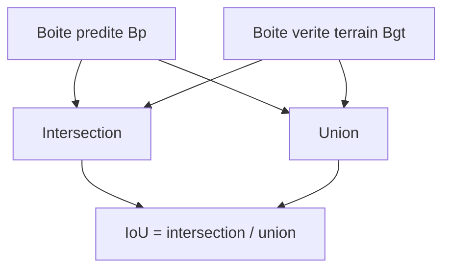

# Jour 1 - Fondamentaux de vision par ordinateur et descripteurs classiques

## 1. Objectif du chapitre

- Distinguer classification, detection et reconnaissance sans ambiguite.
- Construire un pipeline complet image -> features -> mesure -> interpretation.
- Manipuler OpenCV pour pretraiter, segmenter et visualiser.
- Comprendre HOG et SIFT avec intuition, maths et comparaison pratique.
- Produire des livrables testables et reproductibles.

Alignement syllabus Jour 1:

- Bloc A (3h30): S'introduire a la vision par ordinateur.
- Bloc B (3h30): Decrire des images avec descripteurs classiques.

## 2. Introduction (importance du chapitre)

Le Jour 1 construit la base methodologique du module. Avant les CNN et detecteurs modernes, il faut savoir poser le probleme, transformer l'image utilement, puis mesurer objectivement la qualite des resultats.

Sans cette base, on risque de lancer des modeles "boite noire" sans comprendre pourquoi ils reussissent ou echouent.

## 3. Prerequis

- Python 3.
- Bases `numpy` (tableaux, dimensions, operations elementaires).
- Bases image (pixel, canaux, niveaux de gris).
- OpenCV, NumPy, Matplotlib installes.

## 4. Concepts cles

### 4.1 Classification

- Entree: image complete.
- Sortie: une seule classe.
- Question: "Qu'y a-t-il dans l'image ?"

### 4.2 Detection

- Entree: image complete.
- Sortie: boites + classes + scores.
- Question: "Ou sont les objets et quels sont-ils ?"

### 4.3 Reconnaissance

- Entree: objet ou region detectee.
- Sortie: identite fine (personne, logo, reference produit).
- Question: "Quel objet exact est present ?"

### 4.4 Schema de positionnement des taches


### 4.5 Pipeline vision complet


### 4.6 Mini cas concrets

- Industrie: verifier un joint -> IoU + seuil qualite.
- Retail: detecter et reconnaitre des produits -> precision/rappel + erreurs de confusion.
- Route: detecter pietons/vehicules -> compromis precision/rappel en temps reel.

## 5. Formulation mathematique (quand necessaire)

### 5.1 Contexte mathematique

Deux besoins complementaires:

- mesurer la qualite de localisation (IoU),
- mesurer la proximite visuelle entre representations (distance).

### 5.2 Symboles et notations

- $B_p$: boite predite.
- $B_{gt}$: boite verite terrain.
- $A_{inter}$: aire d'intersection.
- $A_{union}$: aire d'union.
- $\mathbf{x}, \mathbf{y}$: vecteurs descripteurs.
- $n$: dimension du descripteur.

### 5.3 Formules en format math

$$
IoU = \frac{|B_p \cap B_{gt}|}{|B_p \cup B_{gt}|}
$$

$$
d(\mathbf{x}, \mathbf{y}) = \sqrt{\sum_{i=1}^{n}(x_i - y_i)^2}
$$

### 5.4 Lecture mathematique

- IoU: rapport intersection/union.
- Distance: norme euclidienne de l'ecart entre deux vecteurs.

### 5.5 Lecture textuelle

- Plus la superposition est bonne, plus IoU monte vers 1.
- Plus deux objets se ressemblent dans l'espace de features, plus la distance baisse.

### 5.6 Sens de la formule

- IoU valide la geometrie de detection.
- La distance valide la similarite de description visuelle.

### 5.7 Decomposition mathematique pas a pas

$$
\text{Etape 1: } A_{inter} = |B_p \cap B_{gt}|
$$

$$
\text{Etape 2: } A_{union} = |B_p| + |B_{gt}| - A_{inter}
$$

$$
\text{Etape 3: } IoU = \frac{A_{inter}}{A_{union}}
$$

### 5.8 Exemple numerique guide

Avec $|B_p|=1200$, $|B_{gt}|=1000$, $A_{inter}=800$:

$$
A_{union}=1200+1000-800=1400
$$

$$
IoU=\frac{800}{1400}\approx0.571
$$

### 5.9 Resultat attendu et interpretation

- $IoU \approx 0.57$: acceptable selon contexte, insuffisant pour controle strict.
- Exemple regle metier: passage si $IoU \ge 0.7$.

### 5.10 Schema visuel IoU



## 6. Exemple Python complet (code commente)

Le script complet est dans `labs/jour1/day1_lab.py`.

```python
# Lancer:
# python3 labs/jour1/day1_lab.py

import json
from pathlib import Path
import cv2
import numpy as np

def make_synthetic_scene(shape: str, shift: int = 0) -> np.ndarray:
    img = np.zeros((256, 256, 3), dtype=np.uint8)
    if shape == "rectangle":
        cv2.rectangle(img, (40 + shift, 60), (180 + shift, 190), (255, 255, 255), -1)
    elif shape == "circle":
        cv2.circle(img, (120 + shift, 130), 60, (255, 255, 255), -1)
    else:
        raise ValueError("shape must be 'rectangle' or 'circle'")
    return img

def iou(box_a, box_b):
    x_left = max(box_a[0], box_b[0])
    y_top = max(box_a[1], box_b[1])
    x_right = min(box_a[2], box_b[2])
    y_bottom = min(box_a[3], box_b[3])
    if x_right <= x_left or y_bottom <= y_top:
        return 0.0
    inter = (x_right - x_left) * (y_bottom - y_top)
    area_a = (box_a[2] - box_a[0]) * (box_a[3] - box_a[1])
    area_b = (box_b[2] - box_b[0]) * (box_b[3] - box_b[1])
    return inter / (area_a + area_b - inter)

def bbox_from_threshold(gray):
    _, th = cv2.threshold(gray, 127, 255, cv2.THRESH_BINARY)
    points = cv2.findNonZero(th)
    x, y, w, h = cv2.boundingRect(points)
    return (x, y, x + w, y + h)

img_gt = make_synthetic_scene("rectangle", 0)
img_pred = make_synthetic_scene("rectangle", 12)

gray_gt = cv2.cvtColor(img_gt, cv2.COLOR_BGR2GRAY)
gray_pred = cv2.cvtColor(img_pred, cv2.COLOR_BGR2GRAY)

box_gt = bbox_from_threshold(gray_gt)
box_pred = bbox_from_threshold(gray_pred)

metrics = {"iou_score": float(iou(box_pred, box_gt))}
Path("outputs/jour1").mkdir(parents=True, exist_ok=True)
Path("outputs/jour1/metrics_minimal.json").write_text(json.dumps(metrics, indent=2), encoding="utf-8")
print(json.dumps(metrics, indent=2))
```

## 7. Explication detaillee du code

- Le script fabrique des scenes synthetiques controlees.
- Le seuillage extrait automatiquement une boite englobante.
- Le calcul IoU donne une mesure objective de localisation.
- La sauvegarde JSON impose une trace reproductible des resultats.

## 8. Lab pas a pas (tres guide)

### 8.1 Objectif du lab

Passer de la theorie a un pipeline mesurable, puis comparer les resultats entre scenes proches et differentes.

### 8.2 Setup environnement

```bash
python3 -m venv .venv
source .venv/bin/activate
pip install -U pip
pip install opencv-python numpy matplotlib
```

Si `venv`/`pip` manque sur Debian minimal:

```bash
sudo apt install python3-venv python3-pip
```

### 8.3 Etapes d'execution

1. Verifier `labs/jour1/day1_lab.py`.
2. Executer `python3 labs/jour1/day1_lab.py`.
3. Verifier `outputs/jour1/metrics.json`.
4. Verifier `outputs/jour1/figures/jour1_overview.png`.
5. Interpretrer les metriques.

Sortie attendue (ordre de grandeur):

- `iou_score`: valeur dans $(0,1]$.
- `hog_dimension`: strictement positive et stable.
- `hog_different_l2` > `hog_shifted_l2` dans la majorite des cas.
- `sift_good_matches_similar` > `sift_good_matches_different` dans la majorite des cas.

### 8.4 Verification (checkpoints)

- A: `iou_score` dans l'intervalle attendu.
- B: distance HOG plus grande pour scene differente.
- C: matching SIFT meilleur pour scene similaire.

### 8.4.bis Sortie attendue

- Les valeurs exactes peuvent varier, mais les relations A>B/C doivent rester cohérentes.
- Les artefacts doivent toujours etre generes.

### 8.5 Erreurs frequentes et correction

- `ModuleNotFoundError: cv2` -> installer `opencv-python`.
- `No module named pip/venv` -> installer paquets systeme `python3-pip`, `python3-venv`.
- Resultats incoherents -> verifier que le code n'a pas ete modifie entre extraction et evaluation.

### 8.6 Validation technique du code

- Syntaxe: `python3 -m py_compile labs/jour1/day1_lab.py`
- Execution: `python3 labs/jour1/day1_lab.py`

Commande rapide:

```bash
python3 -m py_compile labs/jour1/day1_lab.py && python3 labs/jour1/day1_lab.py
```

Diagnostic rapide:

- IoU faible: revoir boites/seuillage/decalage.
- Distances HOG trop proches: augmenter contraste entre scenes.
- Trop de faux matches SIFT: diminuer le ratio test.

### 8.7 Labs progressifs (3 niveaux)

Lab 1 (base): executer tel quel et commenter les metriques.

Lab 2 (parametres):

- varier `shift` (6, 12, 24, 36),
- tracer l'evolution de `iou_score`.

Lab 3 (robustesse):

- ajouter bruit gaussien et variation de luminosite,
- comparer l'impact sur HOG et SIFT.

## 9. Resume et points a retenir

- Le trio classification/detection/reconnaissance doit etre maitrise avant la suite.
- Un bon pipeline combine transformation, mesure et interpretation.
- IoU, HOG, SIFT forment une base solide et interpretable.
- La qualite d'un cours se juge aussi sur des sorties testables.

## 10. Mini exercices

- Exercice 1: expliquer pourquoi IoU baisse quand `shift` augmente.
- Exercice 2: tester un seuil binaire different et commenter.
- Exercice 3: comparer ratio test 0.6/0.75/0.9 sur les faux matches.

## 11. Livrables attendus

- Script `labs/jour1/day1_lab.py` execute.
- `outputs/jour1/metrics.json`.
- `outputs/jour1/figures/jour1_overview.png`.
- Mini rapport (5-10 lignes) avec interpretation.

## 12. Cadre version etudiant (obligatoire)

- Chapitre centre apprentissage et autonomie.
- Pas de notes formateur ni corrige complet cache.
- Auto-verification via checkpoints et metriques.

## 13. References (sources en ligne)

- [R1] Stanford CS231n Schedule: `https://cs231n.stanford.edu/2024/schedule.html`
- [R2] CS231n Course Notes: `https://cs231n.github.io/`
- [R3] OpenCV HOGDescriptor API: `https://docs.opencv.org/4.x/d5/d33/structcv_1_1HOGDescriptor.html`
- [R4] OpenCV SIFT API: `https://docs.opencv.org/4.x/d7/d60/classcv_1_1SIFT.html`
- [R5] D. Lowe, SIFT (IJCV 2004): `https://www.cs.ubc.ca/~lowe/papers/ijcv04.pdf`
- [R6] PASCAL VOC Challenge (IJCV 2010): `https://www.robots.ox.ac.uk/~vgg/projects/pascal/VOC/pubs/everingham10.pdf`
