# Jour 1 — Fondamentaux de vision par ordinateur et descripteurs classiques

## 1. Objectif du chapitre

Ce chapitre couvre les deux blocs du Jour 1 du syllabus officiel :

- **Bloc A (3 h 30)** : S'introduire à la vision par ordinateur
- **Bloc B (3 h 30)** : Décrire des images

**Compétences visées**
- Distinguer sans ambiguïté les tâches de classification, de détection et de reconnaissance.
- Identifier les étapes d'un pipeline de vision par ordinateur.
- Manipuler des images en Python avec OpenCV : lecture, redimensionnement, histogramme, seuillage.
- Extraire des caractéristiques visuelles (features) d'une image.
- Implémenter et comparer les descripteurs HOG et SIFT avec OpenCV.
- Produire des résultats reproductibles, mesurables et exploitables.

**Résultat concret**
En fin de chapitre, l'étudiant exécute un pipeline complet sur une image réelle : lecture OpenCV, conversion en niveaux de gris, histogrammes, égalisation, seuillage, contours, IoU contrôlée, gradients HOG et matching SIFT. Les résultats sont sauvegardés sous forme de figures et de métriques JSON.

**Projet filé — introduction**
Tout au long de ce module, un projet filé accompagne l'apprentissage. L'objectif final (Jour 3) est de construire un système de détection d'objets sur des images réelles, de l'évaluer avec des métriques standard (IoU, mAP), et de présenter les résultats.
Les compétences acquises ce jour — manipulation d'images avec OpenCV, calcul de l'IoU, extraction de descripteurs — constituent les briques de base de ce système.
Vous serez amenés à réutiliser et combiner ces briques au fil des trois jours.

## 2. Introduction

La vision par ordinateur permet aux machines de comprendre le contenu visuel. Avant d'utiliser des réseaux de neurones profonds, il est indispensable de maîtriser les fondamentaux : comment une image est représentée numériquement, comment on la transforme, et comment on en extrait une information structurée.

Ce premier chapitre pose le socle méthodologique du module. Il répond à trois questions :

1. Quelle tâche veut-on résoudre : classification, détection ou reconnaissance ?
2. Comment préparer et transformer une image avec OpenCV ?
3. Comment décrire une image de façon mesurable pour la comparer à d'autres ?

La logique de travail est la suivante : définir l'objectif, transformer l'image, extraire une représentation, calculer des mesures, interpréter les résultats.

## 3. Prérequis

- Python 3 et bases de programmation.
- Manipulation de tableaux avec NumPy.
- Notions de pixels, canaux (R, V, B) et niveaux de gris.
- Environnement virtuel avec OpenCV, NumPy et Matplotlib installés.

```bash
python3 -m venv .venv
source .venv/bin/activate
pip install opencv-python numpy matplotlib
```

## 4. Concepts clés : classification, détection, reconnaissance

### 4.1 Définitions

**Classification**
- Entrée : une image complète.
- Sortie : une classe globale (ex. : "chat", "voiture", "avion").
- Question métier : « Quel type d'objet est présent dans l'image ? »

**Détection**
- Entrée : une image complète.
- Sortie : des boîtes englobantes + des classes + des scores de confiance.
- Question métier : « Où se trouvent les objets et de quelle catégorie sont-ils ? »

**Reconnaissance**
- Entrée : un objet ou une région déjà localisée.
- Sortie : une identité fine (personne, produit, logo, référence).
- Question métier : « Quel objet précis est observé ? »

### 4.2 Schéma de positionnement des tâches

La même image peut être exploitée selon trois objectifs différents. Le passage de la classification à la reconnaissance augmente progressivement la précision attendue de la sortie.

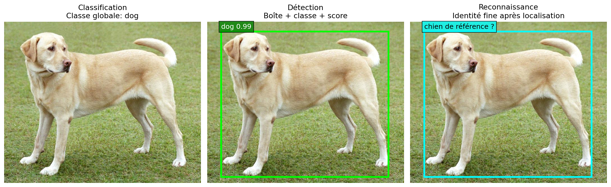

**Lecture de l'image**
- **Contexte** : cette figure utilise la même photo réelle pour comparer trois objectifs de vision par ordinateur. Elle sert à distinguer clairement les sorties attendues avant d'aborder les modèles.
- **Ce qu'on observe** : en classification, toute l'image reçoit une seule étiquette globale. En détection, l'objet est localisé avec une boîte. En reconnaissance, on part d'une zone déjà localisée pour chercher une identité ou une référence plus précise.
- **Notion technique** : ces trois tâches ne produisent pas le même type de sortie : label global, boîtes avec classes, puis identité fine. Elles ne s'évaluent donc pas avec exactement les mêmes métriques.
- **Message à retenir** : plus on va de la classification vers la reconnaissance, plus la sortie attendue devient précise et contraignante.

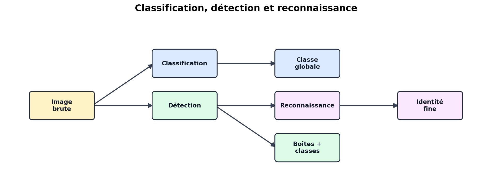

**Lecture du schéma**
- **Contexte** : le schéma formalise la différence entre classification, détection et reconnaissance. Il transforme l'exemple visuel précédent en pipeline conceptuel.
- **Ce qu'on observe** : l'image brute peut aller directement vers une classification globale, ou vers une détection qui produit des boîtes. La reconnaissance arrive ensuite comme une étape plus fine appliquée sur une région déjà trouvée.
- **Notion technique** : la détection ajoute une localisation spatiale, puis la reconnaissance ajoute une identification fine. Faster R-CNN et YOLO feront surtout de la détection ; le projet bonus de reconnaissance faciale illustre la reconnaissance.
- **Message à retenir** : classifier, détecter et reconnaître sont trois niveaux différents d'analyse, même lorsqu'ils utilisent la même image de départ.

### 4.3 Cas d'usage concrets

**Contrôle qualité industriel**
- Problème : vérifier la présence et la position d'un composant.
- Attendu : localisation fiable de la zone d'intérêt.
- Mesure clef : IoU entre boîte prédite et boîte de référence.

**Commerce de détail**
- Problème : compter et identifier des produits en rayon.
- Attendu : boîtes cohérentes + classe correcte par produit.
- Mesures clés : précision, rappel de détection.

**Vidéo routière**
- Problème : détecter piétons et véhicules en flux continu.
- Attendu : bon compromis qualité / vitesse.
- Mesures clés : rappel, précision, latence par image.

## 5. Le pipeline de vision par ordinateur

### 5.1 Les étapes

Le pipeline ci-dessous montre la chaîne utilisée dans le lab : une image réelle est transformée progressivement jusqu'à produire des informations exploitables par un système de détection.

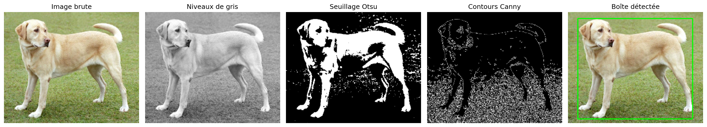

**Lecture de l'image**
- **Contexte** : cette figure montre un pipeline de vision appliqué à une image réelle. Elle relie les opérations OpenCV de base à une première forme de localisation d'objet.
- **Ce qu'on observe** : l'image couleur est convertie en niveaux de gris, puis transformée par seuillage. Les contours sont extraits et certaines zones deviennent des boîtes candidates.
- **Notion technique** : chaque étape réduit ou restructure l'information : couleur vers intensité, intensité vers masque binaire, masque vers contours, contours vers coordonnées de boîtes.
- **Message à retenir** : au Jour 1, le but n'est pas une détection parfaite, mais la compréhension du passage d'une image brute à une information structurée.

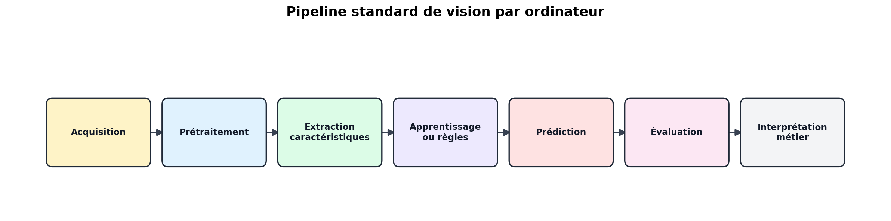

**Lecture du schéma**
- **Contexte** : ce schéma donne la version abstraite du pipeline de vision par ordinateur. Il sert de fil conducteur pour tout le module.
- **Ce qu'on observe** : l'image passe par l'acquisition, le prétraitement, l'extraction de caractéristiques, la prédiction, l'évaluation puis l'interprétation métier.
- **Notion technique** : une erreur tôt dans la chaîne, par exemple une mauvaise lecture couleur ou un mauvais seuillage, peut se propager jusqu'à la décision finale.
- **Message à retenir** : les étapes simples du Jour 1 restent importantes même lorsque les Jours 2 et 3 utilisent des modèles profonds.

**Lecture du pipeline**
1. **Acquisition** : capturer l'image (caméra, fichier, flux vidéo).
2. **Prétraitement** : nettoyer, redimensionner, convertir en niveaux de gris.
3. **Extraction de caractéristiques** : calculer des descripteurs (HOG, SIFT, histogrammes).
4. **Apprentissage ou règles** : entraîner un modèle ou définir des seuils.
5. **Prédiction** : classifier, détecter ou reconnaître.
6. **Évaluation** : mesurer la performance (IoU, précision, rappel).
7. **Interprétation métier** : traduire le résultat en décision.

### 5.2 Représentation numérique d'une image

Une image numérique est un tableau. En couleur, chaque pixel contient trois valeurs. OpenCV lit ces valeurs en ordre **BGR**, alors que Matplotlib les affiche généralement en **RGB**.

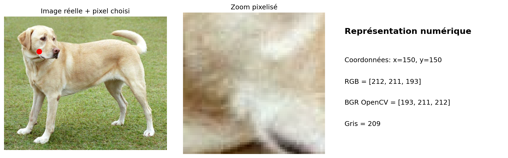

**Lecture de l'image**
- **Contexte** : cette figure relie l'image visible à sa représentation numérique. Elle montre ce qu'un programme manipule réellement lorsqu'il lit une image.
- **Ce qu'on observe** : le zoom pixelisé rappelle qu'une image est une matrice de valeurs. Le pixel sélectionné possède trois composantes de couleur.
- **Notion technique** : Matplotlib affiche généralement en RGB, alors qu'OpenCV lit les images en BGR. Cette différence peut inverser les couleurs si elle n'est pas gérée explicitement.
- **Message à retenir** : une image est un tableau numérique ; comprendre sa forme et l'ordre des canaux évite des erreurs invisibles dans les traitements suivants.

**À retenir**
- Une image couleur OpenCV a une forme `(hauteur, largeur, 3)`.
- Un pixel couleur contient trois intensités entre 0 et 255.
- Une image en niveaux de gris a une forme `(hauteur, largeur)`.
- Les coordonnées image sont généralement notées `(x, y)`, mais la forme NumPy est `(hauteur, largeur)`.

## 6. Manipuler des images avec OpenCV

Cette section couvre le premier bloc du syllabus : lecture, redimensionnement, histogramme et seuillage.

### 6.1 Lecture et affichage

OpenCV lit les images sous forme de tableaux NumPy. L'ordre des canaux est BGR (et non RGB).

```python
import cv2

# Lecture d'une image depuis un fichier
img = cv2.imread("image.jpg")

# Informations de base
print("Type :", type(img))         # numpy.ndarray
print("Forme :", img.shape)        # (hauteur, largeur, canaux)
print("Type de données :", img.dtype)  # uint8
```

**Explication**
- `cv2.imread` retourne un tableau de forme `(hauteur, largeur, 3)` pour une image couleur.
- Si l'image n'est pas trouvée, `cv2.imread` retourne `None` sans lever d'exception.
- Les canaux sont dans l'ordre **BGR**, ce qui est l'inverse de la convention RGB de Matplotlib.

### 6.2 Conversion en niveaux de gris

```python
# Conversion BGR -> niveaux de gris
gris = cv2.cvtColor(img, cv2.COLOR_BGR2GRAY)
print("Forme niveaux de gris :", gris.shape)  # (hauteur, largeur)
```

**Explication**
- La fonction `cv2.cvtColor` applique une combinaison linéaire pondérée des canaux :
  `Gris = 0.299 * R + 0.587 * V + 0.114 * B`
- Ces poids reflètent la sensibilité différente de l'œil humain aux couleurs.

### 6.3 Redimensionnement

```python
# Redimensionnement à une taille fixe
redimensionnee = cv2.resize(img, (128, 64), interpolation=cv2.INTER_AREA)

# Redimensionnement par facteur (x2)
x2 = cv2.resize(img, None, fx=2, fy=2, interpolation=cv2.INTER_CUBIC)
```

**Explication**
- Le second argument est `(largeur, hauteur)`, l'inverse de la forme NumPy.
- Le choix de l'interpolation influence la qualité :
  - `INTER_AREA` : recommandée pour la réduction (évite le crénelage).
  - `INTER_CUBIC` : recommandée pour l'agrandissement (plus fluide).
  - `INTER_LINEAR` : par défaut, bon compromis vitesse / qualité.

### 6.4 Histogramme

L'histogramme répartit les valeurs de pixels par niveau d'intensité. C'est un outil essentiel pour analyser la luminosité et le contraste.

Sur une vraie image, l'histogramme révèle immédiatement si l'information est concentrée dans les zones sombres, moyennes ou claires. Il permet aussi de comparer les canaux couleur.

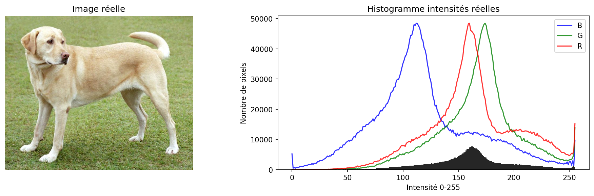

**Lecture de l'image**
- **Contexte** : cette figure introduit l'histogramme comme outil d'analyse de luminosité et de contraste. Elle permet de comprendre l'image sans se limiter à l'observation visuelle.
- **Ce qu'on observe** : l'image réelle est affichée à gauche et la distribution des intensités à droite. Les pics indiquent les valeurs très présentes dans l'image.
- **Notion technique** : un histogramme concentré dans les faibles intensités indique une image sombre ; un histogramme étalé indique plus de contraste. Les courbes par canal montrent que chaque couleur porte une information différente.
- **Message à retenir** : l'histogramme aide à choisir un prétraitement adapté, par exemple égalisation, seuillage ou normalisation.

```python
import cv2
import numpy as np
import matplotlib
matplotlib.use("Agg")  # Mode sans affichage (serveur, SSH)
import matplotlib.pyplot as plt

# Image de test : générer ou utiliser labs/jour1/assets/test_scene.png
img = np.zeros((200, 300, 3), dtype=np.uint8)
cv2.rectangle(img, (50, 40), (250, 160), (255, 255, 255), -1)
gris = cv2.cvtColor(img, cv2.COLOR_BGR2GRAY)

histogramme = cv2.calcHist([gris], [0], None, [256], [0, 256])
plt.plot(histogramme, color='black')
plt.title("Histogramme des niveaux de gris")
plt.xlabel("Intensite (0-255)")
plt.ylabel("Nombre de pixels")
plt.savefig("histogramme.png")  # Sauvegarde au lieu de plt.show()
```

**Explication**
- `cv2.calcHist` calcule la fréquence de chaque valeur de pixel.
- Un histogramme concentré à gauche indique une image sombre.
- Un histogramme étalé sur toute la plage indique un bon contraste.
- Sur un serveur ou en SSH, utiliser `matplotlib.use("Agg")` et `plt.savefig()` au lieu de `plt.show()`.

**Égalisation d'histogramme**

L'égalisation redistribue les intensités pour améliorer le contraste d'une image sous-exposée.

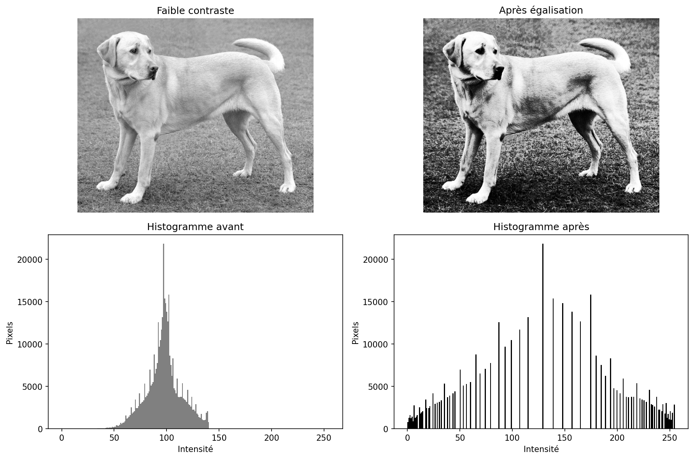

**Lecture de l'image**
- **Contexte** : cette figure montre l'effet d'une égalisation d'histogramme sur une image à faible contraste. Elle illustre un prétraitement classique avant analyse.
- **Ce qu'on observe** : avant égalisation, les intensités occupent une plage limitée. Après égalisation, les niveaux sont redistribués sur une plage plus large et certains détails deviennent plus visibles.
- **Notion technique** : l'égalisation applique une transformation cumulative des intensités. Elle améliore souvent le contraste local ou global, mais modifie aussi la distribution statistique de l'image.
- **Message à retenir** : améliorer le contraste peut aider la détection, mais ce n'est pas une opération neutre ; il faut vérifier son effet sur les données réelles.

```python
import cv2

# Chargement d'une image à faible contraste
# img = cv2.imread("labs/jour1/assets/test_low_contrast.png")
# gris = cv2.cvtColor(img, cv2.COLOR_BGR2GRAY)

# Égalisation : étale l'histogramme sur toute la plage [0, 255]
gris_equalise = cv2.equalizeHist(gris)

# Comparaison : avant vs après
cv2.imwrite("avant_equalisation.png", gris)
cv2.imwrite("apres_equalisation.png", gris_equalise)
print("Histogramme avant : min =", gris.min(), "max =", gris.max())
print("Histogramme après : min =", gris_equalise.min(), "max =", gris_equalise.max())
```

**Explication**
- `cv2.equalizeHist` applique une transformation cumulative sur l'histogramme.
- Les pixels sombres deviennent plus variés, les détails cachés apparaissent.
- Très utile en prétraitement avant la détection ou le seuillage.

### 6.5 Seuillage

Le seuillage transforme une image en binaire : chaque pixel devient noir ou blanc selon un seuil.

Sur une image réelle, le choix du seuil influence fortement le résultat. Un seuil fixe est simple mais fragile ; Otsu estime automatiquement un seuil global ; le seuillage adaptatif varie localement selon la luminosité.

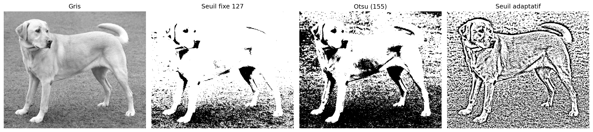

**Lecture de l'image**
- **Contexte** : cette figure compare plusieurs méthodes de seuillage sur une image réelle. Elle montre pourquoi une méthode simple peut être fragile selon l'éclairage.
- **Ce qu'on observe** : le seuil fixe applique la même règle partout, Otsu choisit automatiquement un seuil global, et le seuil adaptatif varie localement selon le voisinage.
- **Notion technique** : le seuillage transforme une image d'intensités en masque binaire. Cette transformation impose une séparation entre objet et fond, souvent sensible au contraste et à la luminosité.
- **Message à retenir** : aucun seuil n'est universel. Il faut choisir la méthode selon la distribution des intensités et les variations locales de l'image.

```python
# Seuillage binaire simple
_, binaire = cv2.threshold(gris, 127, 255, cv2.THRESH_BINARY)

# Seuillage inverse
_, binaire_inv = cv2.threshold(gris, 127, 255, cv2.THRESH_BINARY_INV)

# Seuil adaptatif (varie localement)
adaptatif = cv2.adaptiveThreshold(
    gris, 255, cv2.ADAPTIVE_THRESH_GAUSSIAN_C,
    cv2.THRESH_BINARY, 11, 2
)
```

**Explication**
- `cv2.threshold` compare chaque pixel au seuil (ici 127).
- Si pixel > seuil : valeur maximale (255 = blanc). Sinon : 0 (noir).
- Le seuillage adaptatif calcule un seuil local pour chaque voisinage, utile quand la luminosité varie dans l'image.

### 6.6 Contours et extraction de boîtes

Après le seuillage, l'étape naturelle est d'extraire les contours pour isoler les objets. C'est le lien direct avec la détection vue au Jour 2.

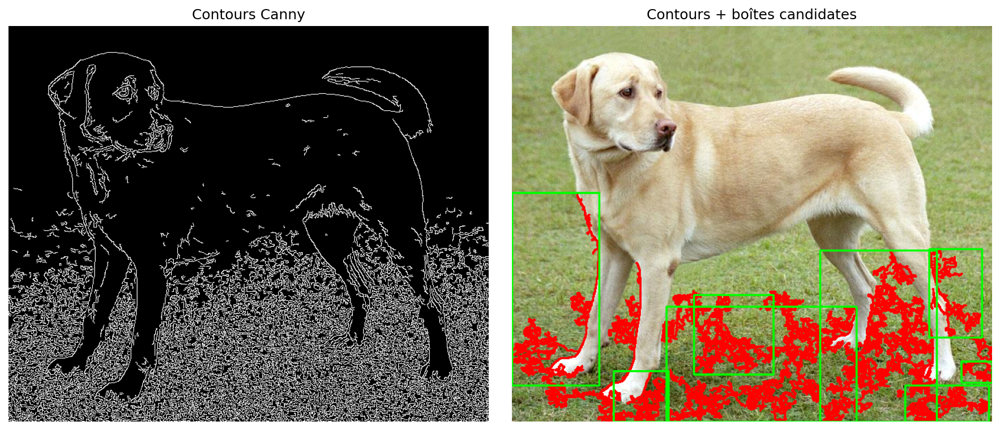

**Lecture de l'image**
- **Contexte** : cette figure relie le traitement d'image classique à la notion de détection. Elle montre comment passer d'un masque ou de contours à des zones localisées.
- **Ce qu'on observe** : Canny met en évidence les discontinuités fortes, comme les bords d'objet, les textures et les transitions de luminosité. Certains contours sont ensuite convertis en boîtes candidates.
- **Notion technique** : une boîte candidate donne des coordonnées spatiales, mais pas encore une classe fiable ni un score de confiance appris. Elle localise une région plausible sans comprendre son contenu.
- **Message à retenir** : les contours introduisent la localisation ; Faster R-CNN et YOLO généraliseront cette idée avec des modèles capables de classer et scorer les objets.

```python
import cv2
import numpy as np

# Image binaire après seuillage
img = np.zeros((200, 300, 3), dtype=np.uint8)
cv2.rectangle(img, (50, 40), (250, 160), (255, 255, 255), -1)
gris = cv2.cvtColor(img, cv2.COLOR_BGR2GRAY)
_, binaire = cv2.threshold(gris, 127, 255, cv2.THRESH_BINARY)

# Détection des contours
contours, hierarchy = cv2.findContours(binaire, cv2.RETR_EXTERNAL, cv2.CHAIN_APPROX_SIMPLE)
print(f"Nombre d'objets détectés : {len(contours)}")

# Extraction de la boîte englobante pour chaque contour
for i, contour in enumerate(contours):
    x, y, w, h = cv2.boundingRect(contour)
    print(f"Objet {i} : x={x}, y={y}, largeur={w}, hauteur={h}")
    # Dessiner la boîte sur l'image originale
    cv2.rectangle(img, (x, y), (x + w, y + h), (0, 255, 0), 2)

cv2.imwrite("contours_detectes.png", img)
```

**Explication**
- `cv2.findContours` identifie les contours dans une image binaire.
- `cv2.RETR_EXTERNAL` ne récupère que les contours les plus externes (un objet = un contour).
- `cv2.CHAIN_APPROX_SIMPLE` compresse les segments horizontaux, verticaux et diagonaux.
- `cv2.boundingRect` retourne la boîte englobante minimale pour chaque contour.
- C'est exactement la logique utilisée pour passer d'une segmentation brute à une détection structurée.

### 6.7 Exemple complet OpenCV

```python
# Script : openCV_bases.py
# Démontrer lecture, conversion, resize, histogramme, seuillage

import cv2
import numpy as np

# 1) Création d'une image synthétique (rectangle blanc sur fond noir)
img = np.zeros((200, 300, 3), dtype=np.uint8)
cv2.rectangle(img, (50, 40), (250, 160), (255, 255, 255), -1)

# 2) Conversion en niveaux de gris
gris = cv2.cvtColor(img, cv2.COLOR_BGR2GRAY)

# 3) Redimensionnement
petite = cv2.resize(gris, (64, 32), interpolation=cv2.INTER_AREA)

# 4) Histogramme
hist = cv2.calcHist([gris], [0], None, [256], [0, 256])
print(f"Pixels noirs (valeur 0) : {int(hist[0][0])}")
print(f"Pixels blancs (valeur 255) : {int(hist[255][0])}")

# 5) Seuillage binaire
_, binaire = cv2.threshold(gris, 127, 255, cv2.THRESH_BINARY)
points = cv2.findNonZero(binaire)
x, y, w, h = cv2.boundingRect(points)
print(f"Boîte détectée : x={x}, y={y}, w={w}, h={h}")
```

**Explication du code**
Ce script démontre la chaîne complète de manipulation d'image. On crée une scène simple, on la convertit, on la réduit, on analyse sa répartition d'intensités, puis on isole l'objet par seuillage et on en récupère la position. C'est exactement la logique utilisée dans le lab de ce chapitre.

## 7. Fondements mathématiques : IoU et distance euclidienne

### 7.1 Contexte mathématique

Deux besoins apparaissent dès le Jour 1 :
- évaluer la qualité de localisation d'un objet détecté,
- évaluer la similarité visuelle entre deux représentations d'image.

### 7.2 Symboles et notations

- $B_p$ : boîte prédite.
- $B_{gt}$ : boîte de référence (ground truth).
- $A_{inter}$ : aire d'intersection.
- $A_{union}$ : aire d'union.
- $\mathbf{x}, \mathbf{y}$ : vecteurs de descripteurs.
- $n$ : dimension du descripteur.

### 7.3 Intersection over Union (IoU)

$$
IoU = \frac{|B_p \cap B_{gt}|}{|B_p \cup B_{gt}|}
$$

**Lecture mathematique**
« IoU égale l'aire de l'intersection de B indice p et B indice gt divisée par l'aire de leur union. »

**Lecture textuelle**
L'IoU mesure le rapport entre la zone commune aux deux boîtes et la zone totale qu'elles couvrent ensemble. C'est un nombre entre 0 (aucun overlap) et 1 (superposition parfaite).

**Sens de la formule**
Le numérateur force à considérer uniquement la zone réelle de superposition. Le dénominateur pénalise les boîtes trop grandes ou trop petites. Un IoU élevé signifie une bonne localisation.

**Décomposition pas à pas**

$$
\text{Étape 1 : } x_{gauche} = \max(x_{p1}, x_{gt1}), \quad y_{haut} = \max(y_{p1}, y_{gt1})
$$

$$
\text{Étape 2 : } x_{droite} = \min(x_{p2}, x_{gt2}), \quad y_{bas} = \min(y_{p2}, y_{gt2})
$$

$$
\text{Étape 3 : } A_{inter} = \max(0, x_{droite} - x_{gauche}) \times \max(0, y_{bas} - y_{haut})
$$

$$
\text{Étape 4 : } A_{union} = |B_p| + |B_{gt}| - A_{inter}
$$

$$
\text{Étape 5 : } IoU = \frac{A_{inter}}{A_{union}}
$$

**Exemple numerique guide**

$$
|B_p| = 1200, \quad |B_{gt}| = 1000, \quad A_{inter} = 800
$$

$$
A_{union} = 1200 + 1000 - 800 = 1400
$$

$$
IoU = \frac{800}{1400} \approx 0.571
$$

**Résultat attendu et interprétation**
- $IoU \approx 0.57$ : détection acceptable dans un scénario souple.
- En controle industriel strict, un seuil de $0.7$ ou $0.8$ peut etre impose.

### 7.4 Schéma visuel de l'IoU

La figure ci-dessous montre deux boîtes partiellement superposées. La zone violette correspond à l'intersection. L'union correspond à toute la surface couverte par les deux boîtes.

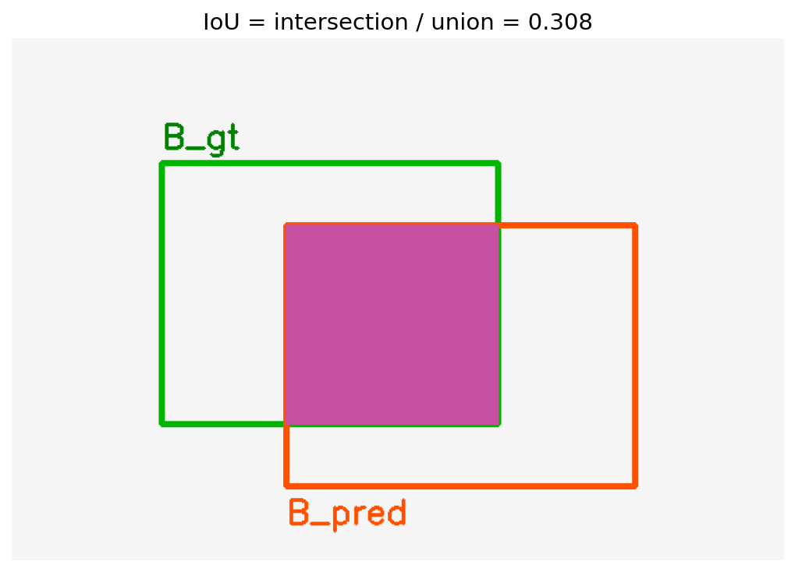

**Lecture de l'image**
- **Contexte** : cette figure visualise l'IoU, la métrique centrale pour évaluer une localisation. Elle rend concrète la formule mathématique précédente.
- **Ce qu'on observe** : la boîte verte représente la vérité terrain et la boîte orange une prédiction. La zone violette correspond à l'intersection, c'est-à-dire la partie commune aux deux boîtes.
- **Notion technique** : l'IoU compare l'aire d'intersection à l'aire d'union. Une prédiction trop décalée, trop grande ou trop petite fait baisser le score.
- **Message à retenir** : l'IoU transforme une impression visuelle de qualité de localisation en score objectif compris entre 0 et 1.

### 7.5 Distance euclidienne entre descripteurs

$$
d(\mathbf{x}, \mathbf{y}) = \sqrt{\sum_{i=1}^{n}(x_i - y_i)^2}
$$

**Lecture mathematique**
« d de x et y égale la racine carrée de la somme des carrés des différences composante par composante. »

**Lecture textuelle**
On calcule l'écart entre chaque composante des deux vecteurs, on met au carré, on somme, puis on prend la racine. Plus le résultat est petit, plus les deux images se ressemblent.

**Résultat attendu**
- Distance faible : forte similarité visuelle.
- Distance élevée : images visuellement différentes.

## 8. Descripteurs visuels : HOG et SIFT

### 8.1 HOG — Histogram of Oriented Gradients

HOG résume la structure globale des contours d'une image sous forme d'histogramme d'orientations de gradients.

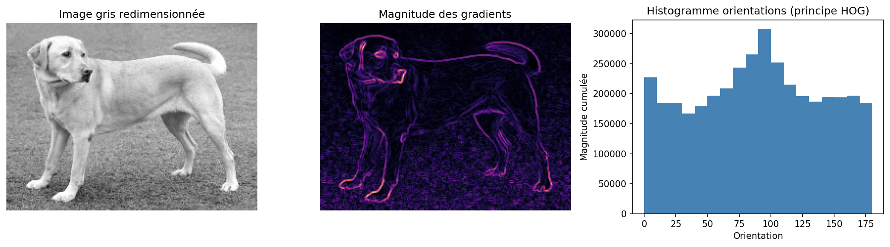

**Lecture de l'image**
- **Contexte** : cette figure introduit HOG, un descripteur classique basé sur les orientations de gradients. Elle montre ce que HOG retient d'une image.
- **Ce qu'on observe** : la première vue est l'image en niveaux de gris. La seconde met en évidence la magnitude des gradients, où les zones claires correspondent aux bords. L'histogramme regroupe ensuite les orientations dominantes.
- **Notion technique** : HOG encode la structure locale des contours dans des cellules, puis normalise ces informations par blocs pour limiter l'effet des variations de luminosité.
- **Message à retenir** : HOG ne reconnaît pas directement un objet ; il produit un vecteur qui décrit sa géométrie de contours.

**Fonctionnement**
1. Calcul des gradients horizontaux et verticaux de l'image.
2. Division de l'image en cellules (ex. : 8x8 pixels).
3. Pour chaque cellule, histogramme des directions de gradient (ex. : 9 bins sur 0-180°).
4. Normalisation par blocs de cellules pour la robustesse à la luminosité.

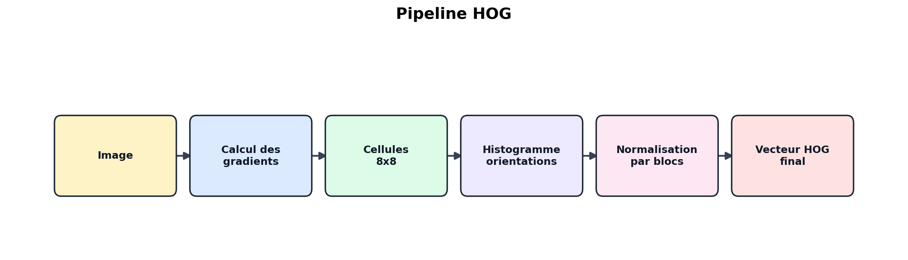

**Lecture du schéma**
- **Contexte** : ce schéma détaille les étapes internes de HOG. Il complète la visualisation précédente avec une lecture algorithmique.
- **Ce qu'on observe** : l'image est convertie en gradients, découpée en cellules, résumée par histogrammes locaux, puis normalisée par blocs.
- **Notion technique** : le résultat final est un vecteur numérique de taille fixe. Ce vecteur peut être donné à un classifieur classique, par exemple SVM, pour détecter une catégorie d'objet.
- **Message à retenir** : HOG est une méthode structurée et interprétable, mais ses caractéristiques sont conçues manuellement et non apprises à partir des données.

**Points importants**
- Sensible à la géométrie globale de l'objet.
- Robuste pour des formes contrastees.
- Souvent utilisé comme référence de départ en vision classique.
- Utilise historiquement pour la detection de pietons.

### 8.2 SIFT — Scale-Invariant Feature Transform

SIFT détecte des points clés locaux invariants à l'échelle et à la rotation, puis calcule un descripteur autour de chaque point.

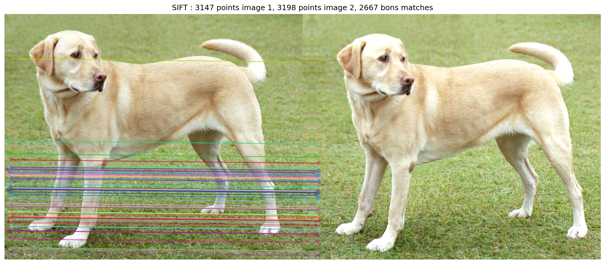

**Lecture de l'image**
- **Contexte** : cette figure illustre SIFT, une méthode de matching local entre deux images. Elle sert à comprendre comment reconnaître un même objet malgré une transformation.
- **Ce qu'on observe** : les deux images sont proches mais pas identiques. Les lignes relient des points clés dont les descripteurs se ressemblent suffisamment.
- **Notion technique** : chaque point clé possède un descripteur local robuste à l'échelle et à la rotation. Le matching compare ces vecteurs, souvent avec une distance euclidienne et le ratio test de Lowe.
- **Message à retenir** : SIFT est adapté à la reconnaissance par correspondances locales, surtout quand l'objet peut changer de taille, d'orientation ou de position.

**Fonctionnement**
1. Détection de points clés à différentes échelles (Difference of Gaussians).
2. Attribution d'une orientation dominante a chaque point cle.
3. Calcul d'un descripteur 128 dimensions autour de chaque point.
4. Matching par distance euclidienne avec le test de ratio de Lowe.

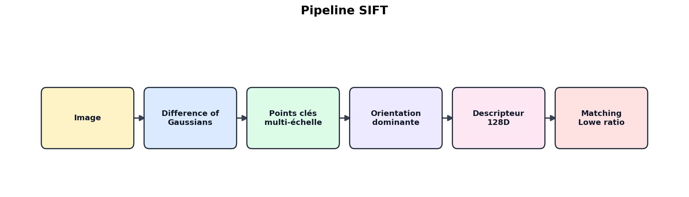

**Lecture du schéma**
- **Contexte** : ce schéma présente la chaîne complète SIFT. Il montre comment passer d'une image à des correspondances exploitables.
- **Ce qu'on observe** : SIFT détecte d'abord des points stables à plusieurs échelles, leur attribue une orientation, calcule un descripteur, puis compare les descripteurs entre images.
- **Notion technique** : le descripteur SIFT encode le voisinage d'un point en 128 dimensions. Le ratio test de Lowe élimine les correspondances ambiguës lorsque les deux meilleurs voisins sont trop proches.
- **Message à retenir** : SIFT ne décrit pas toute l'image en un seul vecteur ; il construit un ensemble de points locaux robustes que l'on peut apparier.

**Test de ratio de Lowe**
Pour chaque descripteur, on trouve les 2 plus proches voisins. Le match est valide si :

$$
\frac{d_{1}}{d_{2}} < 0.75
$$

Ou $d_1$ est la distance au plus proche voisin et $d_2$ au second. Cela elimine les matches ambigus.

**Points importants**
- Robuste aux changements d'échelle et de rotation.
- Adapté au matching local et à la reconnaissance d'objets.
- Plus lent que HOG mais plus precis pour l'appariement.

### 8.3 Comparaison HOG vs SIFT

| Critère | HOG | SIFT |
|---|---|---|
| Type | Descripteur global | Points clés locaux |
| Invariance à l'échelle | Non | Oui |
| Invariance à la rotation | Non | Oui |
| Dimension | Fixe, par exemple 3780 | Variable selon le nombre de points clés |
| Vitesse | Rapide | Plus lent |
| Usage principal | Détection d'objets | Matching et reconnaissance locale |

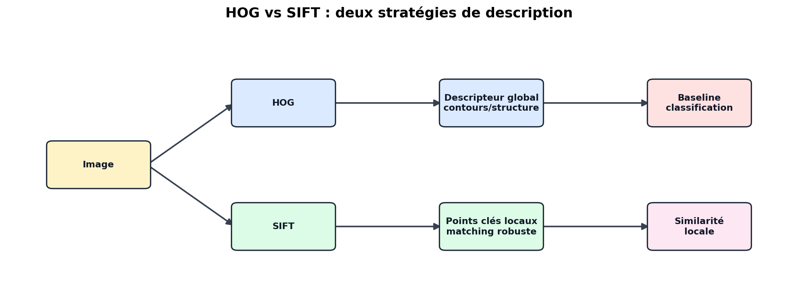

**Lecture du schéma**
- **Contexte** : ce schéma compare deux familles de descripteurs classiques. Il aide à choisir la méthode selon le problème visé.
- **Ce qu'on observe** : HOG décrit globalement une fenêtre d'image, alors que SIFT décrit localement des points clés. Les sorties et les usages ne sont donc pas les mêmes.
- **Notion technique** : HOG produit un vecteur de taille fixe, pratique pour une classification sur fenêtres. SIFT produit un nombre variable de descripteurs locaux, pratique pour le matching et la reconnaissance malgré certaines transformations.
- **Message à retenir** : HOG et SIFT sont des références historiques utiles pour comprendre les features, avant de passer aux caractéristiques apprises automatiquement par les CNN.

## 9. Exemples Python par concept

### 9.1 Calcul de l'IoU

```python
def iou(box_a, box_b):
    # Boîtes au format (x1, y1, x2, y2)
    x_left = max(box_a[0], box_b[0])
    y_top = max(box_a[1], box_b[1])
    x_right = min(box_a[2], box_b[2])
    y_bottom = min(box_a[3], box_b[3])

    if x_right <= x_left or y_bottom <= y_top:
        return 0.0  # Pas d'intersection

    inter = (x_right - x_left) * (y_bottom - y_top)
    area_a = (box_a[2] - box_a[0]) * (box_a[3] - box_a[1])
    area_b = (box_b[2] - box_b[0]) * (box_b[3] - box_b[1])
    return inter / (area_a + area_b - inter)

# Test
box_gt = (40, 60, 180, 190)
box_pred = (52, 60, 192, 190)
print(f"IoU = {iou(box_pred, box_gt):.3f}")
```

**Explication**
On calcule les coordonnées du rectangle d'intersection, on vérifie qu'il est valide, puis on applique la formule IoU. Le résultat est un nombre entre 0 et 1.

### 9.2 Extraction HOG

```python
import cv2
import numpy as np

# Préparation : image synthétique rectangulaire
img = np.zeros((200, 300, 3), dtype=np.uint8)
cv2.rectangle(img, (50, 40), (250, 160), (255, 255, 255), -1)
image_grise = cv2.cvtColor(img, cv2.COLOR_BGR2GRAY)

# Redimensionnement obligatoire (fenetre fixe)
gris = cv2.resize(image_grise, (128, 64), interpolation=cv2.INTER_AREA)

hog = cv2.HOGDescriptor(
    _winSize=(128, 64),
    _blockSize=(16, 16),
    _blockStride=(8, 8),
    _cellSize=(8, 8),
    _nbins=9,
)
descripteur = hog.compute(gris)
print(f"Dimension du descripteur : {descripteur.shape[0]}")
```

**Explication**
Le descripteur HOG a une taille fixe déterminée par les paramètres. Avec une fenêtre de 128x64, des blocs de 16x16, un stride de 8x8, 9 bins, on obtient un vecteur de 3780 dimensions.

### 9.3 Détection SIFT et matching

```python
import cv2
import numpy as np

# Préparation : deux images synthétiques similaires
img1 = np.zeros((200, 300, 3), dtype=np.uint8)
cv2.rectangle(img1, (50, 40), (250, 160), (255, 255, 255), -1)
image_grise = cv2.cvtColor(img1, cv2.COLOR_BGR2GRAY)

sift = cv2.SIFT_create()
kp, desc = sift.detectAndCompute(image_grise, None)
print(f"Nombre de points clés : {len(kp)}")

# Seconde image (léger décalage) pour le matching
img2 = np.zeros((200, 300, 3), dtype=np.uint8)
cv2.rectangle(img2, (55, 42), (255, 162), (255, 255, 255), -1)
gray2 = cv2.cvtColor(img2, cv2.COLOR_BGR2GRAY)
kp2, desc2 = sift.detectAndCompute(gray2, None)

# Matching avec test de ratio de Lowe
desc1 = desc
bf = cv2.BFMatcher(cv2.NORM_L2)
matches = bf.knnMatch(desc1, desc2, k=2)

bons_matches = []
for m, n in matches:
    if m.distance < 0.75 * n.distance:
        bons_matches.append(m)

print(f"Bons matches : {len(bons_matches)}")
```

**Explication**
SIFT détecte automatiquement les points clés et calcule les descripteurs. Le matching compare les descripteurs de deux images. Le test de Lowe élimine les matches ambigus en comparant la distance au premier voisin avec celle du second.

## 10. Lab pas a pas

### 10.1 Objectif du lab

Construire, exécuter et analyser un pipeline mesurable complet qui :
- exploite une image réelle cohérente avec la suite du module,
- génère des figures professionnelles pour histogrammes, seuillage, contours, HOG et SIFT,
- calcule l'IoU entre boîtes de référence et boîtes prédites,
- extrait et compare des descripteurs HOG,
- détecte et matche des points clés SIFT,
- produit une figure de synthèse et un fichier de métriques JSON.

### 10.2 Arborescence

```
nexa-computer-vision/
├── labs/jour1/
│   ├── day1_lab.py              # Script principal
│   ├── day1_minimal_iou.py      # Version minimale (IoU seul)
│   ├── setup_images.py          # Generation d'images de test
│   └── assets/
│       ├── test_scene.png       # Scene multi-objets
│       └── test_low_contrast.png # Image faible contraste
└── outputs/jour1/
    ├── metrics.json              # Metriques completes
    ├── metrics_minimal.json      # Metriques IoU seules
    └── figures/
        ├── jour1_overview.png    # Figure de synthese
        ├── 01_task_comparison.png # Classification/détection/reconnaissance
        ├── 02_cv_pipeline_real.png # Pipeline sur image réelle
        ├── 03_image_representation_pixels.png # Pixel et valeurs RGB/BGR
        ├── 04_histogram_real_image.png # Histogrammes réels
        ├── 05_equalization_before_after.png # Égalisation
        ├── 06_thresholding_comparison.png # Seuillages comparés
        ├── 07_contours_and_boxes.png # Contours et boîtes
        ├── 08_iou_visual_explanation.png # IoU visuelle
        ├── 09_hog_gradient_visualization.png # Gradients HOG
        ├── 10_sift_keypoints_matching.png # Matching SIFT
        ├── iou_vs_shift.png      # Courbe décalage vs IoU
        └── canny_edges.png       # Détection de contours
```

### 10.3 Execution

```bash
# Depuis la racine du projet
source .venv/bin/activate

# (Optionnel) Générer des images de test réelles
.venv/bin/python labs/jour1/setup_images.py

# Executer le lab complet
.venv/bin/python labs/jour1/day1_lab.py
```

### 10.4 Verification (checkpoints)

**Checkpoint A — IoU valide**
- `iou_score` est un nombre entre 0 et 1.
- Valeur typique attendue : environ 0.84 pour un décalage de 12 pixels.

**Checkpoint B — Separation HOG**
- `hog_different_l2` > `hog_shifted_l2`.
- La distance entre formes différentes doit être plus grande qu'entre formes similaires décalées.

**Checkpoint C — Separation SIFT**
- `sift_good_matches_similar` > `sift_good_matches_different`.
- Plus de bons matches entre images similaires qu'entre images différentes.

### 10.5 Sortie attendue

```json
{
  "iou_score": 0.843,
  "bbox_gt": [40, 60, 181, 191],
  "bbox_pred": [52, 60, 193, 191],
  "hog_dimension": 3780,
  "hog_shifted_l2": 5.26,
  "hog_different_l2": 8.37,
  "sift_kp_gt": 2,
  "sift_kp_pred": 6,
  "sift_kp_other": 14,
  "sift_good_matches_similar": 2,
  "sift_good_matches_different": 0,
  "figure_path": "outputs/jour1/figures/jour1_overview.png"
}
```

**Interpretation rapide**
- IoU ~ 0.84 : bonne localisation malgré le décalage.
- HOG : la distance est plus faible pour des formes proches (5.26) que pour des formes différentes (8.37).
- SIFT : les formes simples (rectangle, cercle) génèrent peu de points clés, mais le motif de séparation est correct.

### 10.6 Erreurs frequentes et correction

| Erreur | Cause | Correction |
|--------|-------|------------|
| `ModuleNotFoundError: No module named 'cv2'` | OpenCV non installe | `pip install opencv-python` |
| `ModuleNotFoundError: No module named 'matplotlib'` | Matplotlib manquant | `pip install matplotlib` |
| IoU = 0.0 | Seuillage incorrect ou objets ne se superposant pas | Vérifier les valeurs de shift et le seuil |
| HOG : dimensions différentes | Images non redimensionnées à la même taille | Toujours faire `cv2.resize` avant `hog.compute` |
| SIFT : aucun point clé | Image trop simple (formes géométriques pleines) | Utiliser des images texturées ou complexes |

### 10.7 Validation technique

```bash
.venv/bin/python -m py_compile labs/jour1/day1_lab.py && .venv/bin/python labs/jour1/day1_lab.py
```

Si le script s'exécute sans erreur et que `metrics.json` est généré, le lab est valide.

### 10.8 Parcours progressif recommandé

- **Niveau 1** : exécution standard et lecture des métriques.
- **Niveau 2** : varier `shift` (5, 12, 25, 50) et étudier l'impact sur l'IoU.
- **Niveau 3** : ajouter du bruit gaussien ou modifier la luminosité, analyser la robustesse de HOG et SIFT.

### 10.9 Exercice bonus — Courbe shift vs IoU

Cet exercice produit une visualisation de la relation entre le décalage et la qualité de localisation.

```python
import json
import numpy as np
import matplotlib
matplotlib.use("Agg")
import matplotlib.pyplot as plt

from labs.jour1.day1_lab import make_synthetic_scene, bbox_from_threshold, iou

shifts = range(0, 60, 5)
iou_scores = []

img_gt = make_synthetic_scene("rectangle", shift=0)
gray_gt = bbox_from_threshold(__import__("cv2").cvtColor(img_gt, __import__("cv2").COLOR_BGR2GRAY))

for s in shifts:
    img_pred = make_synthetic_scene("rectangle", shift=s)
    gray_pred = __import__("cv2").cvtColor(img_pred, __import__("cv2").COLOR_BGR2GRAY)
    box_pred = bbox_from_threshold(gray_pred)
    box_gt = (40, 60, 181, 191)  # Reference fixe
    iou_scores.append(iou(box_pred, box_gt))

plt.figure(figsize=(8, 4))
plt.plot(shifts, iou_scores, marker="o", linewidth=2, color="steelblue")
plt.axhline(0.7, color="red", linestyle="--", label="Seuil 0.7")
plt.title("Impact du décalage sur l'IoU")
plt.xlabel("Decalage (pixels)")
plt.ylabel("IoU")
plt.legend()
plt.grid(True, alpha=0.3)
plt.savefig("outputs/jour1/figures/iou_vs_shift.png", dpi=130)
plt.close()
print("Courbe sauvegardée : outputs/jour1/figures/iou_vs_shift.png")
```

**Attendu** : la courbe décroît de façon monotone. L'IoU passe de ~0.95 (`shift=0`) à ~0.1 (`shift=55`). Le seuil de 0.7 est atteint autour de `shift=20-25`.

### 10.10 Exercice bonus — Détection de contours (Canny)

```python
import cv2
import numpy as np

# Chargement d'une image réelle ou synthétique
img = np.zeros((300, 400, 3), dtype=np.uint8)
cv2.rectangle(img, (30, 40), (180, 200), (255, 255, 255), -1)
cv2.circle(img, (300, 150), 60, (255, 200, 0), -1)

gris = cv2.cvtColor(img, cv2.COLOR_BGR2GRAY)

# Détection de contours Canny
contours = cv2.Canny(gris, 100, 200)
cv2.imwrite("outputs/jour1/figures/canny_edges.png", contours)

# Compter les pixels de contour
n_contour_pixels = cv2.countNonZero(contours)
print(f"Pixels de contour : {n_contour_pixels}")
```

**Attendu** : Canny détecte les bords du rectangle et du cercle. Cette méthode est un prétraitement classique avant les approches CNN du Jour 2.

## 11. Resume et points a retenir

- Classification, détection et reconnaissance sont trois tâches distinctes avec des sorties différentes.
- Le pipeline de vision suit une chaîne logique : acquisition, prétraitement, extraction, prédiction, évaluation.
- OpenCV permet de lire, convertir, redimensionner, analyser (histogramme), segmenter (seuillage) et extraire des contours (findContours, Canny) d'une image.
- L'égalisation d'histogramme (`cv2.equalizeHist`) améliore le contraste avant toute analyse.
- L'IoU est la métrique standard pour évaluer la qualité de localisation en détection.
- HOG décrit la structure globale des contours, SIFT détecte des points clefs locaux invariants.
- La reproductibilité et la mesure sont des exigences centrales en vision par ordinateur.

## 11.b Lien avec le Jour 2

Les compétences acquises ce jour constituent le socle du Jour 2 :

- Le **seuillage** et l'extraction de **contours** introduisent la notion de localisation d'objets, qui sera généralisée par les réseaux de neurones convolutifs (CNN).
- L'**IoU** sera la métrique d'évaluation des détecteurs Faster R-CNN.
- Les **descripteurs HOG et SIFT** sont des ancetres des features apprises automatiquement par les CNN.
- Le **pipeline de vision** (acquisition -> prétraitement -> extraction -> prédiction) restera la structure de référence, même avec des modèles profonds.

**Transition** : le Jour 2 abordera la construction d'un CNN simple avec PyTorch, puis l'utilisation d'un détecteur Faster R-CNN pré-entraîné.

## 12. Mini exercices

1. Calculer l'IoU à la main pour deux boîtes : $B_p = (10, 10, 60, 60)$ et $B_{gt} = (20, 20, 70, 70)$.
2. Modifier le seuil binaire de 127 à 80 et observer l'effet sur la boîte détectée.
3. Tester trois valeurs de ratio Lowe (0.60, 0.75, 0.90) et commenter l'évolution du nombre de bons matches et de faux matches.
4. Expliquer pourquoi l'IoU diminue quand le décalage (`shift`) augmente.

## 13. Livrables attendus

- Script exécuté sans erreur : `labs/jour1/day1_lab.py`.
- Artefacts : `outputs/jour1/metrics.json`, `outputs/jour1/figures/jour1_overview.png`.
- Figures de cours : `outputs/jour1/figures/01_task_comparison.png` à `outputs/jour1/figures/10_sift_keypoints_matching.png`.
- Bonus : `outputs/jour1/figures/iou_vs_shift.png`, `outputs/jour1/figures/canny_edges.png`.
- Note d'analyse courte (5 à 10 lignes) avec interprétation des mesures.

## 14. Cadre version étudiant

- Chapitre orienté autonomie et progression guidée.
- Pas de notes formateur ni de corrigé exhaustif intégré.
- Validation par checkpoints, métriques et livrables.
- Les exercices sont conçus pour être résolus par expérimentation et observation.

## 15. Références

- [R1] Stanford CS231n Schedule : https://cs231n.stanford.edu/2024/schedule.html
- [R2] CS231n Course Notes : https://cs231n.github.io/
- [R3] OpenCV HOGDescriptor API : https://docs.opencv.org/4.x/d5/d33/structcv_1_1HOGDescriptor.html
- [R4] OpenCV SIFT API : https://docs.opencv.org/4.x/d7/d60/classcv_1_1SIFT.html
- [R5] D. Lowe, SIFT (IJCV 2004) : https://www.cs.ubc.ca/~lowe/papers/ijcv04.pdf
- [R6] PASCAL VOC Challenge (IJCV 2010) : https://www.robots.ox.ac.uk/~vgg/projects/pascal/VOC/pubs/everingham10.pdf
- [R7] OpenCV Image Processing Tutorial : https://docs.opencv.org/4.x/d7/d4d/tutorial_py_table_of_contents_imgproc.html
- [R8] OpenCV Thresholding : https://docs.opencv.org/4.x/d7/d4d/tutorial_py_thresholding.html
- [R9] OpenCV Histograms : https://docs.opencv.org/4.x/d5/db5/tutorial_hist_1d_find.html
- [R10] OpenCV Contours : https://docs.opencv.org/4.x/d4/d73/tutorial_py_contours_begin.html
