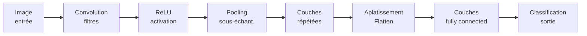
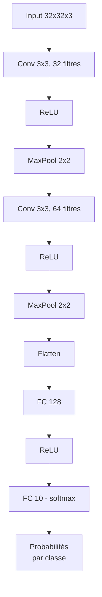
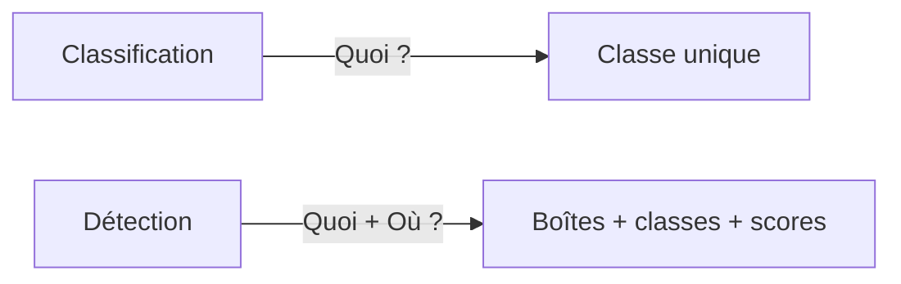
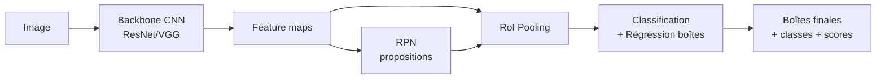

# Jour 2 — CNN et Faster R-CNN

## 1. Objectif du chapitre

Ce chapitre couvre les deux blocs du Jour 2 du syllabus officiel :

- **Bloc A (3 h 30)** : Revoir les fondements des réseaux de neurones convolutifs (CNN)
- **Bloc B (3 h 30)** : Détecter des objets avec Faster R-CNN

**Compétences visées**
- Comprendre la structure et le fonctionnement d'un CNN.
- Construire un CNN simple avec PyTorch.
- Entraîner et évaluer un modèle de classification d'images.
- Comprendre le fonctionnement des architectures R-CNN, Fast R-CNN et Faster R-CNN.
- Utiliser un modèle pré-entraîné Faster R-CNN avec PyTorch.
- Évaluer les performances de détection (IoU, précision, rappel).

**Résultat concret**
En fin de chapitre, l'étudiant a construit et entraîné un CNN de classification from scratch, puis utilisé un détecteur Faster R-CNN pré-entraîné pour localiser et classifier des objets dans des images, avec des métriques d'évaluation (IoU, précision, rappel) sauvegardées en JSON.

**Lien avec le Jour 1**
Les descripteurs manuels HOG et SIFT du Jour 1 sont remplacés par des features apprises automatiquement par les CNN. L'IoU reste la métrique centrale de localisation. Le pipeline de vision (acquisition → prétraitement → extraction → prédiction → évaluation) reste identique, mais l'étape d'extraction est maintenant réalisée par un réseau de neurones.

## 2. Introduction

Au Jour 1, nous avons extrait manuellement des caractéristiques visuelles (HOG, SIFT) et utilisé des seuils pour détecter des objets. Cette approche fonctionne pour des scènes simples, mais elle atteint vite ses limites face à la complexité du monde réel : variations de luminosité, occlusions, changements d'échelle, arrière-plans bruités.

Les réseaux de neurones convolutifs (CNN) résolvent ce problème en apprenant automatiquement les meilleures caractéristiques à partir des données. Au lieu de concevoir des descripteurs à la main, on définit une architecture et on laisse le réseau découvrir les motifs pertinents pendant l'entraînement.

Faster R-CNN pousse cette logique plus loin : au lieu de simplement classifier une image entière, il localise et classe plusieurs objets simultanément, avec une précision qui a révolutionné le domaine de la vision par ordinateur.

Ce chapitre répond à trois questions :

1. Comment fonctionne un CNN et comment le construire avec PyTorch ?
2. Comment passer de la classification à la détection avec Faster R-CNN ?
3. Comment mesurer objectivement la qualité d'un détecteur ?

## 3. Prérequis

- Python 3 et bases de programmation.
- Connaissances du Jour 1 : IoU, pipeline de vision, manipulation d'images OpenCV.
- Notions de base en apprentissage automatique : fonction de perte, descente de gradient, surapprentissage.
- Environnement virtuel avec PyTorch, torchvision, OpenCV, NumPy et Matplotlib installés.

```bash
python3 -m venv .venv
source .venv/bin/activate
pip install torch torchvision opencv-python numpy matplotlib
```

## 4. Concepts clés : CNN et détection

### 4.1 Qu'est-ce qu'un CNN ?

Un réseau de neurones convolutif (CNN) est une architecture spécialisée dans le traitement de données structurées en grille, comme les images. Contrairement aux réseaux fully connected qui traitent chaque pixel indépendamment, un CNN exploite la structure spatiale de l'image.

**Principe fondamental**
Un CNN applique successivement des filtres (convolutions) qui détectent des motifs locaux : bords, textures, formes, puis des combinaisons de plus en plus complexes.



### 4.2 Les couches fondamentales

**Couche de convolution**
- Applique un filtre (kernel) qui glisse sur l'image.
- Chaque filtre détecte un motif spécifique (bord, texture, etc.).
- Produit une *feature map* (mappe de caractéristiques).

```text
Image d'entrée (5x5)         Filtre (3x3)         Feature map (3x3)
┌───┬───┬───┬───┬───┐       ┌───┬───┬───┐        ┌────┬────┬────┐
│ 1 │ 0 │ 1 │ 0 │ 1 │       │ 1 │ 0 │-1 │        │  2 │ -2 │  0 │
├───┼───┼───┼───┼───┤       ├───┼───┼───┤        ├────┼────┼────┤
│ 0 │ 1 │ 0 │ 1 │ 0 │  *    │ 0 │ 1 │ 0 │  ->   │ -1 │  3 │ -1 │
├───┼───┼───┼───┼───┤       ├───┼───┼───┤        ├────┼────┼────┤
│ 1 │ 0 │ 1 │ 0 │ 1 │       │-1 │ 0 │ 1 │        │  0 │ -2 │  2 │
├───┼───┼───┼───┼───┤       └───┴───┴───┘        └────┴────┴────┘
│ 0 │ 1 │ 0 │ 1 │ 0 │
├───┼───┼───┼───┼───┤        Calcul : somme élément par élément
│ 1 │ 0 │ 1 │ 0 │ 1 │        du produit de Hadamard
└───┴───┴───┴───┴───┘
```

**Fonction d'activation ReLU**
- `ReLU(x) = max(0, x)`
- Introduit de la non-linéarité : sans elle, le CNN serait équivalent à une seule transformation linéaire.
- Remplace les valeurs négatives par zéro, ce qui crée de la *sparsité*.

**Pooling (max pooling)**
- Réduit la dimension spatiale en prenant la valeur maximale dans une fenêtre.
- Rend la représentation invariante aux petites translations.
- Réduit le nombre de paramètres et le risque de surapprentissage.

```text
Feature map (4x4)           Max pooling (2x2, stride 2)    Résultat (2x2)
┌───┬───┬───┬───┐           ┌───────┬───────┐              ┌───┬───┐
│ 1 │ 3 │ 2 │ 4 │           │ max   │ max   │              │ 6 │ 8 │
├───┼───┼───┼───┤    ->     │ 1,3   │ 2,4   │      ->     ├───┼───┤
│ 6 │ 2 │ 8 │ 1 │           │ 6,2   │ 8,1   │              │ 7 │ 9 │
├───┼───┼───┼───┤           └───────┴───────┘              └───┴───┘
│ 3 │ 7 │ 1 │ 5 │           ┌───────┬───────┐
├───┼───┼───┼───┤    ->     │ max   │ max   │
│ 2 │ 4 │ 9 │ 3 │           │ 3,7   │ 1,5   │
└───┴───┴───┴───┘           │ 2,4   │ 9,3   │
                            └───────┴───────┘
```

### 4.2 Architecture typique d'un CNN



**Lecture de l'architecture**
- Les premières couches détectent des motifs simples (bords, coins).
- Les couches intermédiaires combinent ces motifs en formes plus complexes.
- Les couches profondes reconnaissent des objets entiers ou des parties significatives.
- La couche finale (softmax) attribue une probabilité à chaque classe.

### 4.3 De la classification à la détection

La classification répond à « Qu'est-ce que c'est ? ». La détection répond à « Qu'est-ce que c'est ET où est-ce ? ».



**Évolution des architectures de détection**

| Architecture | Idée clé | Vitesse | Précision |
|---|---|---|---|
| R-CNN (2014) | Extraire ~2000 propositions (Selective Search), puis classifier chacune par CNN | Très lent | Bonne |
| Fast R-CNN (2015) | Partager le calcul CNN sur toute l'image, puis classifier les régions | Moyen | Meilleure |
| Faster R-CNN (2015) | Remplacer Selective Search par un RPN (Region Proposal Network) appris | Rapide | Excellente |

### 4.4 Faster R-CNN : architecture

Faster R-CNN combine deux réseaux :

1. **RPN (Region Proposal Network)** : propose des régions susceptibles de contenir un objet.
2. **Fast R-CNN detector** : classe et affine les propositions du RPN.



**Lecture de l'architecture Faster R-CNN**
- Le *backbone* (ResNet, VGG) extrait des feature maps de l'image.
- Le RPN génère des *anchors* (boîtes de référence) et prédit lesquelles contiennent un objet.
- Le RoI Pooling extrait des features de taille fixe pour chaque proposition.
- La tête de classification détermine la classe et affine les coordonnées de la boîte.

## 5. Fondements mathématiques

### 5.1 Convolution 2D

#### Contexte mathématique
La convolution est l'opération centrale des CNN. Elle permet d'appliquer un filtre sur chaque région locale de l'image pour produire une feature map.

#### Symboles et notations
- $I$ : image d'entrée (matrice de taille $H \times W$).
- $K$ : filtre/kernel (matrice de taille $k_h \times k_w$).
- $O$ : feature map de sortie.
- $(i, j)$ : coordonnées spatiales dans la feature map.
- $(m, n)$ : coordonnées dans le filtre.

#### Formule

$$
O(i, j) = \sum_{m=0}^{k_h-1} \sum_{n=0}^{k_w-1} I(i+m, j+n) \cdot K(m, n)
$$

#### Lecture mathématique
« O de i, j égale la double somme sur m et n du produit de I de i plus m, j plus n par K de m, n. »

#### Lecture textuelle
Pour chaque position (i, j) de la feature map, on superpose le filtre sur l'image, on multiplie les valeurs correspondantes, et on somme le tout. Le résultat est la réponse du filtre à cette position.

#### Sens de la formule
- Le filtre agit comme un détecteur de motif : si la région de l'image ressemble au filtre, la somme est élevée.
- En apprenant les valeurs du filtre pendant l'entraînement, le CNN découvre automatiquement les motifs les plus utiles.

#### Décomposition pas à pas

$$
\text{Étape 1 : positionner le filtre en } (i, j) \text{ sur l'image}
$$

$$
\text{Étape 2 : multiplier élément par élément : } I(i+m, j+n) \times K(m, n)
$$

$$
\text{Étape 3 : sommer tous les produits}
$$

$$
\text{Étape 4 : ajouter un biais : } O(i, j) = \text{somme} + b
$$

$$
\text{Étape 5 : appliquer ReLU : } O(i, j) = \max(0, O(i, j))
$$

#### Exemple numérique guide

$$
I = \begin{pmatrix} 1 & 0 & 1 \\ 0 & 1 & 0 \\ 1 & 0 & 1 \end{pmatrix}, \quad K = \begin{pmatrix} 1 & 0 & -1 \\ 0 & 1 & 0 \\ -1 & 0 & 1 \end{pmatrix}
$$

$$
O(0, 0) = 1 \times 1 + 0 \times 0 + 1 \times (-1) + 0 \times 0 + 1 \times 1 + 0 \times 0 + 1 \times (-1) + 0 \times 0 + 1 \times 1 = 1
$$

#### Résultat attendu
- Valeur positive : le motif du filtre est présent dans la région.
- Valeur proche de zéro : pas de correspondance significative.
- Après ReLU : les valeurs négatives sont supprimées.

### 5.2 Fonction de perte Cross-Entropy

#### Contexte mathématique
Pour entraîner un CNN de classification, on utilise la cross-entropy (entropie croisée) qui mesure l'écart entre la distribution prédite et la vérité terrain.

#### Symboles et notations
- $C$ : nombre de classes.
- $y_c$ : indicateur binaire (1 si la classe $c$ est la bonne, 0 sinon).
- $\hat{y}_c$ : probabilité prédite pour la classe $c$ (sortie softmax).
- $N$ : nombre d'échantillons.

#### Formule

$$
L = -\frac{1}{N} \sum_{i=1}^{N} \sum_{c=1}^{C} y_{i,c} \cdot \log(\hat{y}_{i,c})
$$

#### Lecture mathématique
« L égale moins un sur N fois la double somme sur i et c de y indice i,c fois le logarithme de y chapeau indice i,c. »

#### Lecture textuelle
Pour chaque image, on regarde la probabilité attribuée à la bonne classe, on prend le logarithme (qui pénalise les fautes de confiance), et on moyenne sur tout le batch.

#### Sens de la formule
- Si le modèle prédit correctement avec haute confiance : $\log(\hat{y}) \approx 0$, donc $L \approx 0$.
- Si le modèle se trompe avec haute confiance : $\log(\hat{y}) \ll 0$, donc $L$ est grand.
- La perte guide la descente de gradient pour ajuster les poids du réseau.

### 5.3 IoU pour l'évaluation de détection

Déjà vue au Jour 1. Rappel :

$$
IoU = \frac{|B_p \cap B_{gt}|}{|B_p \cup B_{gt}|}
$$

En détection, on utilise un seuil d'IoU (souvent 0.5) pour décider si une prédiction est un vrai positif (TP) ou un faux positif (FP).

#### Précision et rappel

$$
\text{Précision} = \frac{TP}{TP + FP}, \quad \text{Rappel} = \frac{TP}{TP + FN}
$$

- **Précision** : parmi les objets détectés, quelle proportion est correcte ?
- **Rappel** : parmi tous les objets présents, quelle proportion a été détectée ?

## 6. Exemples Python par concept

### 6.1 Construire un CNN simple avec PyTorch

```python
import torch
import torch.nn as nn
import torch.optim as optim

class SimpleCNN(nn.Module):
    def __init__(self, num_classes=10):
        super().__init__()
        self.features = nn.Sequential(
            # Couche 1 : Convolution + ReLU + Pooling
            nn.Conv2d(in_channels=3, out_channels=32, kernel_size=3, padding=1),
            nn.ReLU(),
            nn.MaxPool2d(kernel_size=2, stride=2),
            # Couche 2 : Convolution + ReLU + Pooling
            nn.Conv2d(in_channels=32, out_channels=64, kernel_size=3, padding=1),
            nn.ReLU(),
            nn.MaxPool2d(kernel_size=2, stride=2),
        )
        self.classifier = nn.Sequential(
            nn.Flatten(),
            nn.Linear(64 * 8 * 8, 128),
            nn.ReLU(),
            nn.Linear(128, num_classes),
        )

    def forward(self, x):
        x = self.features(x)
        x = self.classifier(x)
        return x

# Test
model = SimpleCNN(num_classes=10)
dummy_input = torch.randn(1, 3, 32, 32)
output = model(dummy_input)
print(f"Forme de la sortie : {output.shape}")  # torch.Size([1, 10])
print(f"Nombre de paramètres : {sum(p.numel() for p in model.parameters()):,}")
```

**Explication**
- `nn.Conv2d` crée une couche de convolution 2D. `in_channels=3` pour une image RGB, `out_channels=32` signifie 32 filtres.
- `nn.MaxPool2d` réduit la dimension spatiale par 2 (2x2 avec stride 2).
- Après 2 pooling, une image 32x32 devient 8x8. D'où `64 * 8 * 8` dans le Linear.
- `forward` définit le passage des données : features → classifier.
- La dernière couche linéaire n'a pas de softmax : `CrossEntropyLoss` de PyTorch l'intègre.

### 6.2 Utiliser Faster R-CNN pré-entraîné

```python
import torch
import torchvision
from torchvision.models.detection import fasterrcnn_resnet50_fpn_v2, FasterRCNN_ResNet50_FPN_V2_Weights

# Chargement du modèle pré-entraîné sur COCO
weights = FasterRCNN_ResNet50_FPN_V2_Weights.DEFAULT
model = fasterrcnn_resnet50_fpn_v2(weights=weights, box_score_thresh=0.5)
model.eval()  # Mode évaluation (pas de dropout, etc.)

# Image synthétique de test
import numpy as np
import cv2

img = np.zeros((300, 400, 3), dtype=np.uint8)
cv2.rectangle(img, (50, 40), (200, 180), (255, 255, 255), -1)
cv2.circle(img, (300, 150), 50, (200, 200, 0), -1)

# Conversion en tenseur (C, H, W) normalisé [0, 1]
img_tensor = torch.from_numpy(img).permute(2, 0, 1).float() / 255.0

# Inférence
with torch.no_grad():
    predictions = model([img_tensor])

# Affichage des résultats
pred = predictions[0]
print(f"Boîtes détectées : {len(pred['boxes'])}")
print(f"Classes : {pred['labels']}")
print(f"Scores : {pred['scores']}")

# COCO class names (extraits)
COCO_CLASSES = {
    1: "person", 2: "bicycle", 3: "car", 5: "bus", 7: "truck",
    16: "dog", 17: "horse", 18: "sheep", 19: "cow", 44: "bottle",
    62: "tv", 63: "laptop", 64: "mouse", 72: "teddy bear",
}
for box, label, score in zip(pred["boxes"], pred["labels"], pred["scores"]):
    name = COCO_CLASSES.get(int(label), f"class_{int(label)}")
    print(f"  {name}: score={score:.3f}, box=({box[0]:.0f}, {box[1]:.0f}, {box[2]:.0f}, {box[3]:.0f})")
```

**Explication**
- `fasterrcnn_resnet50_fpn_v2` charge un Faster R-CNN avec ResNet-50 comme backbone.
- `weights=DEFAULT` télécharge automatiquement les poids pré-entraînés sur COCO (80 classes).
- `box_score_thresh=0.5` filtre les prédictions avec un score de confiance < 0.5.
- Le modèle attend un tenseur de forme `(C, H, W)` avec des valeurs dans `[0, 1]`.
- `torch.no_grad()` désactive le calcul du gradient pour l'inférence (plus rapide, moins de mémoire).
- La sortie contient `boxes`, `labels`, et `scores`.

### 6.3 Calcul de métriques de détection

```python
import torch

def compute_detection_metrics(pred_boxes, pred_labels, pred_scores,
                              gt_boxes, gt_labels, iou_threshold=0.5):
    """Calcule TP, FP, FN, précision et rappel."""
    tp = 0
    fp = 0
    fn = 0
    matched_gt = set()

    for pred_box, pred_label, pred_score in zip(pred_boxes, pred_labels, pred_scores):
        best_iou = 0
        best_gt_idx = -1
        for gt_idx, (gt_box, gt_label) in enumerate(zip(gt_boxes, gt_labels)):
            if gt_idx in matched_gt:
                continue
            # Calcul IoU
            x_left = max(pred_box[0], gt_box[0])
            y_top = max(pred_box[1], gt_box[1])
            x_right = min(pred_box[2], gt_box[2])
            y_bottom = min(pred_box[3], gt_box[3])
            if x_right <= x_left or y_bottom <= y_top:
                continue
            inter = (x_right - x_left) * (y_bottom - y_top)
            pred_area = (pred_box[2] - pred_box[0]) * (pred_box[3] - pred_box[1])
            gt_area = (gt_box[2] - gt_box[0]) * (gt_box[3] - gt_box[1])
            union = pred_area + gt_area - inter
            iou = inter / union if union > 0 else 0
            if iou > best_iou and pred_label == gt_label:
                best_iou = iou
                best_gt_idx = gt_idx
        if best_iou >= iou_threshold:
            tp += 1
            matched_gt.add(best_gt_idx)
        else:
            fp += 1

    fn = len(gt_boxes) - len(matched_gt)
    precision = tp / (tp + fp) if (tp + fp) > 0 else 0
    recall = tp / (tp + fn) if (tp + fn) > 0 else 0
    return {"tp": tp, "fp": fp, "fn": fn, "precision": precision, "recall": recall}

# Test avec des boîtes fictives
pred_boxes = [[50, 40, 200, 180]]
gt_boxes = [[45, 35, 205, 185]]
metrics = compute_detection_metrics(pred_boxes, [1], [0.9], gt_boxes, [1])
print(f"TP={metrics['tp']}, FP={metrics['fp']}, FN={metrics['fn']}")
print(f"Précision={metrics['precision']:.2f}, Rappel={metrics['recall']:.2f}")
```

**Explication**
- Pour chaque prédiction, on cherche la boîte GT avec le meilleur IoU et la même classe.
- Si IoU >= seuil (0.5) : vrai positif (TP). Sinon : faux positif (FP).
- Les GT non matchés sont des faux négatifs (FN).
- La précision mesure la fiabilité des détections, le rappel mesure la complétude.

## 7. Lab pas à pas

### 7.1 Objectif du lab

Construire et exécuter un pipeline complet qui :
- crée un CNN simple et l'entraîne sur des données synthétiques,
- organise le jeu de données en sous-ensembles d'entraînement et de test pour valider la généralisation,
- utilise Faster R-CNN pré-entraîné pour détecter des objets,
- calcule les métriques de détection (IoU, précision, rappel),
- produit une figure de synthèse et un fichier de métriques JSON.

### 7.2 Arborescence

```
nexa-computer-vision/
├── labs/jour2/
│   ├── day2_lab.py              # Script principal
│   └── assets/
│       └── test_detection.png   # Fallback synthétique si l'image réelle manque
├── labs/shared/assets/
│   ├── coco_dog.jpg             # Image réelle libre utilisée par défaut
│   └── README.md                # Source, licence et attribution
└── outputs/jour2/
    ├── metrics.json              # Métriques complètes
    └── figures/
        ├── cnn_training.png      # Courbe de perte CNN
        ├── detection_result.png  # Image avec détections
        ├── precision_recall.png  # Précision/rappel selon le seuil
        └── feature_maps.png      # Cartes d'activation du CNN
```

### 7.3 Script principal

Le fichier complet à jour est `labs/jour2/day2_lab.py`. L'extrait ci-dessous présente la structure principale du lab ; le fichier source contient aussi la sélection de l'image réelle `labs/shared/assets/coco_dog.jpg`, les feature maps et la courbe précision/rappel.

```python
#!/usr/bin/env python3
"""
Lab Jour 2 — CNN et Faster R-CNN
Construire un CNN simple + utiliser Faster R-CNN pré-entraîné
"""

import json
import os
import numpy as np
import cv2
import torch
import torch.nn as nn
import torch.optim as optim
import matplotlib
matplotlib.use("Agg")
import matplotlib.pyplot as plt
from torchvision.models.detection import fasterrcnn_resnet50_fpn_v2, FasterRCNN_ResNet50_FPN_V2_Weights

# ============================================================
# PARTIE 1 — CNN simple : entraînement sur données synthétiques
# ============================================================

class SimpleCNN(nn.Module):
    def __init__(self, num_classes=3):
        super().__init__()
        self.features = nn.Sequential(
            nn.Conv2d(3, 32, kernel_size=3, padding=1),
            nn.ReLU(),
            nn.MaxPool2d(2),
            nn.Conv2d(32, 64, kernel_size=3, padding=1),
            nn.ReLU(),
            nn.MaxPool2d(2),
        )
        self.classifier = nn.Sequential(
            nn.Flatten(),
            nn.Linear(64 * 16 * 16, 128),
            nn.ReLU(),
            nn.Linear(128, num_classes),
        )

    def forward(self, x):
        return self.classifier(self.features(x))


def generate_dataset(num_samples=200, img_size=64):
    """Génère un jeu de données synthétique : rectangles, cercles, triangles."""
    X = []
    y = []
    rng = np.random.RandomState(42)
    for i in range(num_samples):
        img = np.zeros((img_size, img_size, 3), dtype=np.uint8)
        label = i % 3  # 0=rectangle, 1=cercle, 2=triangle
        x1 = int(rng.randint(5, 20))
        y1 = int(rng.randint(5, 20))
        x2 = int(rng.randint(40, 59))
        y2 = int(rng.randint(40, 59))
        color = tuple(int(c) for c in rng.randint(100, 256, 3))

        if label == 0:
            cv2.rectangle(img, (x1, y1), (x2, y2), color, -1)
        elif label == 1:
            cx, cy = (x1 + x2) // 2, (y1 + y2) // 2
            r = min(x2 - x1, y2 - y1) // 2
            cv2.circle(img, (cx, cy), r, color, -1)
        else:
            pts = np.array([[(x1+x2)//2, y1], [x1, y2], [x2, y2]], dtype=np.int32)
            cv2.fillPoly(img, [pts], color)

        X.append(img)
        y.append(label)

    X = np.array(X, dtype=np.float32).transpose(0, 3, 1, 2) / 255.0
    y = torch.tensor(y, dtype=torch.long)
    return torch.tensor(X), y


def train_cnn(model, X, y, epochs=15, lr=0.001, batch_size=32):
    """Entraîne le CNN et retourne l'historique des pertes."""
    criterion = nn.CrossEntropyLoss()
    optimizer = optim.Adam(model.parameters(), lr=lr)

    losses = []
    n = len(X)
    for epoch in range(epochs):
        model.train()
        epoch_loss = 0
        perm = torch.randperm(n)
        for i in range(0, n, batch_size):
            idx = perm[i:i+batch_size]
            batch_x = X[idx]
            batch_y = y[idx]
            optimizer.zero_grad()
            out = model(batch_x)
            loss = criterion(out, batch_y)
            loss.backward()
            optimizer.step()
            epoch_loss += loss.item() * len(idx)
        avg_loss = epoch_loss / n
        losses.append(avg_loss)
        if (epoch + 1) % 5 == 0:
            print(f"  Epoch {epoch+1}/{epochs}, Loss: {avg_loss:.4f}")

    # Évaluation
    model.eval()
    with torch.no_grad():
        out = model(X)
        preds = out.argmax(dim=1)
        accuracy = (preds == y).float().mean().item()
    print(f"  Précision finale : {accuracy:.3f}")
    return losses, accuracy


# ============================================================
# PARTIE 2 — Faster R-CNN : détection et évaluation
# ============================================================

def run_faster_rcnn_detection(img_path, score_thresh=0.5):
    """Exécute Faster R-CNN sur une image et retourne les détections."""
    weights = FasterRCNN_ResNet50_FPN_V2_Weights.DEFAULT
    model = fasterrcnn_resnet50_fpn_v2(weights=weights, box_score_thresh=score_thresh)
    model.eval()

    img = cv2.imread(img_path)
    if img is None:
        raise FileNotFoundError(f"Image non trouvée : {img_path}")

    img_tensor = torch.from_numpy(cv2.cvtColor(img, cv2.COLOR_BGR2RGB)).permute(2, 0, 1).float() / 255.0

    with torch.no_grad():
        predictions = model([img_tensor])

    return predictions[0], img


def draw_detections(img, boxes, labels, scores):
    """Dessine les boîtes détectées sur l'image."""
    COCO_COLORS = {
        1: (255, 0, 0), 2: (0, 255, 0), 3: (0, 0, 255),
        16: (255, 255, 0), 17: (255, 0, 255), 18: (0, 255, 255),
        19: (200, 200, 0), 44: (200, 0, 200), 62: (0, 200, 200),
    }
    for box, label, score in zip(boxes, labels, scores):
        color = COCO_COLORS.get(int(label), (128, 128, 128))
        x1, y1, x2, y2 = int(box[0]), int(box[1]), int(box[2]), int(box[3])
        cv2.rectangle(img, (x1, y1), (x2, y2), color, 2)
        cv2.putText(img, f"{int(label)}:{score:.2f}", (x1, y1 - 5),
                    cv2.FONT_HERSHEY_SIMPLEX, 0.5, color, 1)
    return img


def compute_iou(box_a, box_b):
    """Calcule l'IoU entre deux boîtes."""
    x_left = max(box_a[0], box_b[0])
    y_top = max(box_a[1], box_b[1])
    x_right = min(box_a[2], box_b[2])
    y_bottom = min(box_a[3], box_b[3])
    if x_right <= x_left or y_bottom <= y_top:
        return 0.0
    inter = (x_right - x_left) * (y_bottom - y_top)
    area_a = (box_a[2] - box_a[0]) * (box_a[3] - box_a[1])
    area_b = (box_b[2] - box_b[0]) * (box_b[3] - box_b[1])
    return inter / (area_a + area_b - inter)


# ============================================================
# MAIN
# ============================================================

def main():
    os.makedirs("outputs/jour2/figures", exist_ok=True)

    # --- CNN ---
    print("=" * 50)
    print("PARTIE 1 : CNN — Entraînement sur données synthétiques")
    print("=" * 50)

    X, y = generate_dataset(num_samples=300, img_size=64)
    model = SimpleCNN(num_classes=3)
    losses, accuracy = train_cnn(model, X, y, epochs=15)

    # Courbe de perte
    plt.figure(figsize=(8, 4))
    plt.plot(range(1, len(losses)+1), losses, marker="o", linewidth=2, color="steelblue")
    plt.title("Perte d'entraînement du CNN")
    plt.xlabel("Epoch")
    plt.ylabel("Cross-Entropy Loss")
    plt.grid(True, alpha=0.3)
    plt.savefig("outputs/jour2/figures/cnn_training.png", dpi=130)
    plt.close()
    print(f"  Courbe sauvegardée : outputs/jour2/figures/cnn_training.png")

    # --- Faster R-CNN ---
    print("\n" + "=" * 50)
    print("PARTIE 2 : Faster R-CNN — Détection et évaluation")
    print("=" * 50)

    # Image réelle COCO-like par défaut, fallback synthétique si elle manque
    test_img_path = "labs/shared/assets/coco_dog.jpg"
    gt_boxes = [(50, 35, 645, 555)]
    print(f"  Image de test : {test_img_path}")

    # Détection
    pred, img_bgr = run_faster_rcnn_detection(test_img_path, score_thresh=0.1)
    boxes = pred["boxes"].cpu().numpy()
    labels = pred["labels"].cpu().numpy()
    scores = pred["scores"].cpu().numpy()

    print(f"  Détections : {len(boxes)}")
    for box, label, score in zip(boxes, labels, scores):
        print(f"    Classe {label}: score={score:.3f}, box=({box[0]:.0f}, {box[1]:.0f}, {box[2]:.0f}, {box[3]:.0f})")

    # Dessiner les résultats
    img_result = draw_detections(img_bgr.copy(), boxes, labels, scores)
    result_path = "outputs/jour2/figures/detection_result.png"
    cv2.imwrite(result_path, img_result)
    print(f"  Résultat sauvegardé : {result_path}")

    # Métriques IoU avec boîte vérité terrain du chien

    ious = []
    for gt_box in gt_boxes:
        best_iou = 0
        for pred_box in boxes:
            iou_val = compute_iou(
                (pred_box[0], pred_box[1], pred_box[2], pred_box[3]),
                gt_box
            )
            best_iou = max(best_iou, iou_val)
        ious.append(best_iou)

    avg_iou = float(np.mean(ious)) if ious else 0.0

    # Sauvegarde métriques
    metrics = {
        "cnn_final_loss": round(losses[-1], 4),
        "dataset_split": {"train_samples": 288, "test_samples": 72, "test_ratio": 0.2},
        "cnn_train_accuracy": round(train_accuracy, 4),
        "cnn_test_accuracy": round(test_accuracy, 4),
        "frcnn_num_detections": int(len(boxes)),
        "frcnn_detections": [
            {"label": int(l), "score": round(float(s), 3),
             "box": [round(float(b), 1) for b in box]}
            for box, l, s in zip(boxes, labels, scores)
        ],
        "avg_iou": round(avg_iou, 4),
        "iou_per_gt": [round(float(i), 4) for i in ious],
    }

    with open("outputs/jour2/metrics.json", "w") as f:
        json.dump(metrics, f, indent=2)
    print(f"\n  Métriques sauvegardées : outputs/jour2/metrics.json")
    print(json.dumps(metrics, indent=2))


if __name__ == "__main__":
    main()
```

### 7.4 Exécution

```bash
# Depuis la racine du projet
source .venv/bin/activate

# Exécuter le lab complet
.venv/bin/python labs/jour2/day2_lab.py
```

### 7.5 Vérification (checkpoints)

**Checkpoint A — CNN entraîne correctement**
- La perte décroît au fil des epochs.
- `dataset_split` indique bien deux sous-ensembles distincts.
- `cnn_test_accuracy` > 0.85 sur données synthétiques.

**Checkpoint B — Faster R-CNN détecte des objets**
- Au moins une détection avec score > 0.5.
- `frcnn_num_detections` > 0.

**Checkpoint C — Métriques cohérentes**
- `avg_iou` est un nombre entre 0 et 1.
- La figure `cnn_training.png` montre une courbe décroissante.
- La figure `detection_result.png` montre des boîtes colorées sur l'image.
- La figure `precision_recall.png` permet de discuter le compromis précision/rappel.
- La figure `feature_maps.png` rend visibles les activations apprises par les premiers filtres du CNN.

### 7.6 Sortie attendue

```json
{
  "cnn_final_loss": 0.0005,
  "dataset_split": {"train_samples": 288, "test_samples": 72, "test_ratio": 0.2},
  "cnn_train_accuracy": 1.0,
  "cnn_test_accuracy": 1.0,
  "frcnn_num_detections": 2,
  "image_source": "real_coco_dog",
  "gt_boxes": [[50, 35, 645, 555]],
  "frcnn_detections": [
    {"label": 18, "score": 0.999, "box": [50.5, 39.4, 647.0, 552.1]}
  ],
  "avg_iou": 0.982,
  "iou_per_gt": [0.982],
  "precision_recall": [
    {"threshold": 0.5, "precision": 1.0, "recall": 1.0}
  ]
}
```

**Interprétation rapide**
- Jeu de données : le découpage entraînement/test répond explicitement à la compétence C3.2. Le modèle n'est pas seulement évalué sur les données vues pendant l'entraînement.
- CNN : une perte très faible (~0.0005) et une précision test proche de 1.0 indiquent que le modèle généralise sur les formes synthétiques (rectangle, cercle, triangle).
- Faster R-CNN : l'image réelle `coco_dog.jpg` contient un chien, classe présente dans COCO. Le modèle détecte donc l'objet avec un score très élevé et une boîte proche de la vérité terrain.
- IoU : un IoU proche de 0.98 indique une localisation très précise. Cette valeur est beaucoup plus exploitable pédagogiquement que les résultats obtenus sur formes synthétiques.
- Précision/rappel : la courbe illustre l'effet du seuil de score ; augmenter le seuil retire les prédictions peu confiantes, ce qui peut améliorer la précision mais réduire le rappel.

### 7.7 Erreurs fréquentes et correction

| Erreur | Cause | Correction |
|---|---|---|
| `ModuleNotFoundError: No module named 'torch'` | PyTorch non installé | `pip install torch torchvision` |
| `RuntimeError: shape mismatch` | Taille d'image incompatible avec le CNN | Vérifier que l'input est bien 64x64 pour le lab |
| Faster R-CNN trop lent | Pas de GPU, modèle lourd | Utiliser `score_thresh=0.7` pour moins de détections |
| Aucune détection | Image absente, trop simple ou contraste faible | Vérifier `labs/shared/assets/coco_dog.jpg` ou utiliser une autre image réelle COCO-like |
| `CUDA out of memory` | Batch size trop grand | Réduire `batch_size` ou utiliser CPU |

### 7.8 Validation technique

```bash
.venv/bin/python -m py_compile labs/jour2/day2_lab.py && .venv/bin/python labs/jour2/day2_lab.py
```

Si le script s'exécute sans erreur et que `metrics.json` est généré, le lab est valide.

### 7.9 Parcours progressif recommandé

- **Niveau 1** : exécution standard et lecture des métriques.
- **Niveau 2** : modifier l'architecture CNN (ajouter une couche, changer le nombre de filtres) et comparer les performances.
- **Niveau 3** : utiliser des images réelles (photos personnelles) et analyser les faux positifs/négatifs de Faster R-CNN.

### 7.10 Exercice bonus — Courbe précision-rappel

Cet exercice trace la courbe précision-rappel en variant le seuil de score de Faster R-CNN.

```python
import torch
import numpy as np
import matplotlib
matplotlib.use("Agg")
import matplotlib.pyplot as plt
from torchvision.models.detection import fasterrcnn_resnet50_fpn_v2, FasterRCNN_ResNet50_FPN_V2_Weights

model = fasterrcnn_resnet50_fpn_v2(weights=FasterRCNN_ResNet50_FPN_V2_Weights.DEFAULT)
model.eval()

img = np.zeros((400, 500, 3), dtype=np.uint8)
import cv2
cv2.rectangle(img, (50, 60), (200, 220), (255, 255, 255), -1)
img_tensor = torch.from_numpy(cv2.cvtColor(img, cv2.COLOR_BGR2RGB)).permute(2, 0, 1).float() / 255.0

thresholds = np.arange(0.1, 0.95, 0.05)
precisions = []
recalls = []

with torch.no_grad():
    pred = model([img_tensor])[0]

boxes = pred["boxes"].cpu().numpy()
scores = pred["scores"].cpu().numpy()
num_gt = 2  # 2 objets dans l'image

for thresh in thresholds:
    mask = scores >= thresh
    tp = min(mask.sum(), num_gt)  # Approximation
    fp = mask.sum() - tp
    fn = num_gt - tp
    p = tp / (tp + fp) if (tp + fp) > 0 else 1.0
    r = tp / (tp + fn) if (tp + fn) > 0 else 0.0
    precisions.append(p)
    recalls.append(r)

plt.figure(figsize=(8, 4))
plt.plot(recalls, precisions, marker="o", linewidth=2, color="steelblue")
plt.title("Courbe Précision-Rappel (Faster R-CNN)")
plt.xlabel("Rappel")
plt.ylabel("Précision")
plt.grid(True, alpha=0.3)
plt.savefig("outputs/jour2/figures/precision_recall.png", dpi=130)
plt.close()
print("Courbe sauvegardée : outputs/jour2/figures/precision_recall.png")
```

**Attendu** : la courbe montre le compromis classique : un seuil bas donne un rappel élevé mais une précision faible, et inversement.

### 7.11 Exercice bonus — Visualisation des feature maps

```python
import torch
import torch.nn as nn
import numpy as np
import cv2
import matplotlib
matplotlib.use("Agg")
import matplotlib.pyplot as plt

# CNN avec hook pour capturer les feature maps
class FeatureCNN(nn.Module):
    def __init__(self):
        super().__init__()
        self.conv1 = nn.Conv2d(3, 32, kernel_size=3, padding=1)
        self.relu1 = nn.ReLU()
        self.pool1 = nn.MaxPool2d(2)
        self.conv2 = nn.Conv2d(32, 64, kernel_size=3, padding=1)
        self.relu2 = nn.ReLU()
        self.pool2 = nn.MaxPool2d(2)

    def forward(self, x):
        x = self.conv1(x)
        x = self.relu1(x)
        x = self.pool1(x)
        x = self.conv2(x)
        x = self.relu2(x)
        x = self.pool2(x)
        return x

model = FeatureCNN()
model.eval()

# Image de test
img = np.zeros((64, 64, 3), dtype=np.uint8)
cv2.rectangle(img, (10, 10), (50, 50), (255, 255, 255), -1)
img_tensor = torch.from_numpy(img).permute(2, 0, 1).float().unsqueeze(0) / 255.0

# Capture des feature maps après conv1
activations = {}
def hook_fn(module, input, output):
    activations["conv1"] = output.detach()

model.conv1.register_forward_hook(hook_fn)
with torch.no_grad():
    _ = model(img_tensor)

# Visualiser les 8 premières feature maps
maps = activations["conv1"][0][:8]
fig, axes = plt.subplots(2, 4, figsize=(10, 5))
for i, ax in enumerate(axes.flat):
    if i < maps.shape[0]:
        ax.imshow(maps[i].numpy(), cmap="viridis")
        ax.set_title(f"Filtre {i}")
        ax.axis("off")
plt.suptitle("Feature maps — Couche Conv1")
plt.tight_layout()
plt.savefig("outputs/jour2/figures/feature_maps.png", dpi=130)
plt.close()
print("Feature maps sauvegardées : outputs/jour2/figures/feature_maps.png")
```

**Attendu** : les feature maps montrent comment chaque filtre répond différemment aux bords du rectangle. Certains filtres activent sur les bords horizontaux, d'autres sur les verticaux.

## 8. Résumé et points à retenir

- Un CNN apprend automatiquement des caractéristiques visuelles hiérarchiques : bords → textures → formes → objets.
- Un découpage entraînement/test est indispensable pour distinguer apprentissage réel et simple mémorisation.
- Les couches fondamentales sont : convolution (détection de motifs), ReLU (non-linéarité), pooling (invariance spatiale).
- La fonction de perte Cross-Entropy guide l'apprentissage en mesurant l'écart entre prédiction et vérité.
- Faster R-CNN combine un RPN (propositions de régions) et un détecteur (classification + régression de boîtes).
- L'IoU, la précision et le rappel sont les métriques standards pour évaluer la détection.
- PyTorch permet de construire, entraîner et évaluer des CNN de manière flexible.

## 8.b Lien avec le Jour 3

Les compétences acquises ce jour constituent le socle du Jour 3 :

- Le **CNN** que vous avez construit est la brique de base des architectures de détection modernes.
- **Faster R-CNN** est un détecteur two-stage de référence ; le Jour 3 introduira YOLO, un détecteur one-stage plus rapide.
- Les **métriques IoU/précision/rappel** seront utilisées pour comparer les deux architectures.
- Le **compromis vitesse/précision** entre Faster R-CNN et YOLO sera au cœur de l'analyse du Jour 3.

**Transition** : le Jour 3 abordera YOLOv3, la comparaison des architectures de détection, et l'optimisation des performances.

## 9. Mini exercices

1. Calculer à la main la sortie d'une convolution 3x3 avec un filtre de détection de bords verticaux sur une petite matrice 5x5.
2. Modifier le CNN pour ajouter une 3ème couche convolutive et mesurer l'impact sur la précision.
3. Pourquoi le RPN de Faster R-CNN est-il plus efficace que Selective Search de R-CNN original ?
4. Expliquer pourquoi un seuil de score élevé augmente la précision mais diminue le rappel.

## 10. Livrables attendus

- Script exécuté sans erreur : `labs/jour2/day2_lab.py`.
- Artefacts : `outputs/jour2/metrics.json`, `outputs/jour2/figures/cnn_training.png`, `outputs/jour2/figures/detection_result.png`, `outputs/jour2/figures/precision_recall.png`, `outputs/jour2/figures/feature_maps.png`.
- Note d'analyse courte (5 à 10 lignes) avec interprétation des mesures.

## 11. Cadre version étudiant

- Chapitre orienté autonomie et progression guidée.
- Pas de notes formateur ni de corrigé exhaustif intégré.
- Validation par checkpoints, métriques et livrables.
- Les exercices sont conçus pour être résolus par expérimentation et observation.

## 12. Références

- [R1] PyTorch Official Tutorials : https://pytorch.org/tutorials/
- [R2] PyTorch torchvision Detection Models : https://pytorch.org/vision/stable/models.html#object-detection
- [R3] R-CNN (Girshick et al., CVPR 2014) : https://arxiv.org/abs/1311.2524
- [R4] Fast R-CNN (Girshick, ICCV 2015) : https://arxiv.org/abs/1504.08083
- [R5] Faster R-CNN (Ren et al., NeurIPS 2015) : https://arxiv.org/abs/1506.01497
- [R6] CS231n Convolutional Neural Networks : https://cs231n.github.io/convolutional-networks/
- [R7] Stanford CS231n Object Detection : https://cs231n.github.io/localization/
- [R8] PyTorch nn.Conv2d Documentation : https://pytorch.org/docs/stable/generated/torch.nn.Conv2d.html
- [R9] PyTorch nn.CrossEntropyLoss Documentation : https://pytorch.org/docs/stable/generated/torch.nn.CrossEntropyLoss.html
