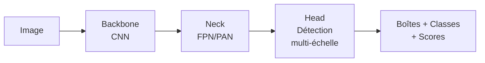
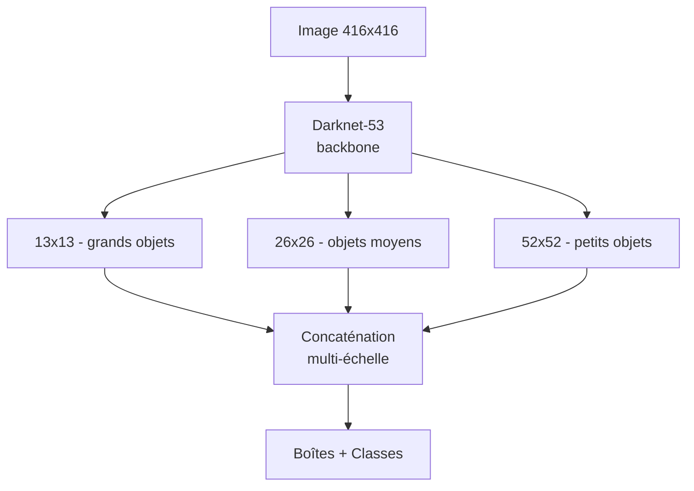
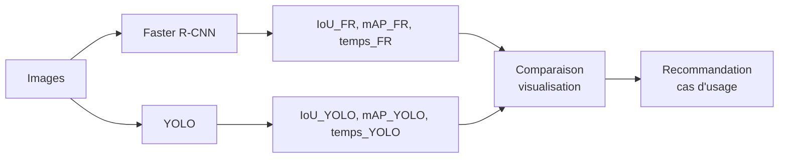

# Jour 3 — YOLO, comparaison et optimisation

## 1. Objectif du chapitre

Ce chapitre couvre le dernier bloc du syllabus officiel :

- **Évaluer et optimiser un détecteur (3H30)** : Comparer les performances des détecteurs et optimiser les hyperparamètres

**Compétences visées**
- Comprendre le fonctionnement de l'architecture YOLO (You Only Look Once).
- Utiliser un modèle YOLO pré-entraîné avec Ultralytics. Le cours présente les principes YOLOv3 historiques, puis le lab utilise YOLOv8n pour disposer d'une implémentation moderne, maintenue et simple à exécuter.
- Comparer les performances de Faster R-CNN et YOLO sur les mêmes images.
- Optimiser les hyperparamètres de détection (seuil de confiance, NMS, taille d'entrée).
- Produire une analyse comparative complète avec métriques et visualisations.

**Résultat concret**
En fin de chapitre, l'étudiant dispose d'un pipeline comparatif qui exécute Faster R-CNN et YOLO sur le même jeu d'images, calcule et visualise les différences de performance (vitesse, IoU, mAP), et identifie le meilleur compromis pour un cas d'usage donné.

**Lien avec les Jours 1 et 2**
- Jour 1 : IoU, pipeline de vision, descripteurs manuels → maintenant évalués contre les approches profondes.
- Jour 2 : CNN, Faster R-CNN → maintenant comparés à YOLO pour analyser le compromis vitesse/précision.
- Jour 3 : synthèse de tout le module avec une évaluation rigoureuse et des recommandations concrètes.

## 2. Introduction

Au Jour 2, nous avons découvert Faster R-CNN, un détecteur two-stage qui offre une excellente précision mais qui reste relativement lent. Dans de nombreuses applications réelles — vidéosurveillance, véhicules autonomes, robots mobiles — la vitesse d'inférence est aussi critique que la précision.

YOLO (You Only Look Once) a révolutionné le domaine en 2016 en proposant une approche one-stage : au lieu de générer d'abord des propositions puis de les classifier, YOLO traite la détection comme un problème de régression unique. L'image entière est passée dans le réseau une seule fois, et les boîtes avec leurs classes sont prédites directement.

Ce chapitre répond à trois questions :

1. Comment fonctionne YOLO et en quoi diffère-t-il de Faster R-CNN ?
2. Comment comparer objectivement deux architectures de détection ?
3. Quels hyperparamètres ajuster pour optimiser le compromis vitesse/précision ?

## 3. Prérequis

- Python 3 et bases de programmation.
- Jours 1 et 2 complétés : IoU, CNN, Faster R-CNN, métriques de détection.
- Environnement virtuel avec PyTorch, torchvision, OpenCV, NumPy et Matplotlib installés.
- (Optionnel) Ultralytics YOLOv8 pour la version moderne de YOLO.

```bash
python3 -m venv .venv
source .venv/bin/activate
pip install torch torchvision opencv-python numpy matplotlib
pip install ultralytics  # YOLOv8 moderne
```

## 4. Concepts clés : YOLO et comparaison de détecteurs

### 4.1 Philosophie YOLO — You Only Look Once

Contrairement à Faster R-CNN qui procède en deux étapes (propositions → classification), YOLO divise l'image en une grille et prédit simultanément pour chaque cellule :

- Des boîtes englobantes (bounding boxes).
- Des scores de confiance par objet.
- Des probabilités par classe.



### 4.2 Architecture YOLOv3

YOLOv3 introduit trois innovations majeures :

1. **Backbone Darknet-53** : 53 couches convolutives avec des connexions résiduelles.
2. **Détection multi-échelle** : 3 sorties à différentes résolutions pour détecter des objets de toutes tailles.
3. **Anchors améliorés** : 9 anchors (3 par échelle) appris par k-means sur COCO.



### 4.3 Grille et prédiction par cellule

Chaque cellule de la grille prédit :

- $B$ boîtes englobantes (chacune avec 5 valeurs : $x, y, w, h, confiance$).
- $C$ probabilités de classe conditionnelles.

```text
Image divisée en grille S x S (ex. : 13 x 13)
┌───┬───┬───┬───┬───┐
│ B │   │   │   │   │  <- Chaque cellule prédit
├───┼───┼───┼───┼───┤     B boîtes + C classes
│   │ B │   │   │   │
├───┼───┼───┼───┼───┤
│   │   │ B │   │   │  <- Le centre de la boîte
├───┼───┼───┼───┼───┤     doit être dans cette cellule
│   │   │   │ B │   │
├───┼───┼───┼───┼───┤
│   │   │   │   │ B │
└───┴───┴───┴───┴───┘
```

### 4.4 Comparaison Faster R-CNN vs YOLO

```text
┌────────────────────┬─────────────────────┬─────────────────────┐
│                    │ Faster R-CNN        │ YOLO                │
├────────────────────┼─────────────────────┼─────────────────────┤
│ Type               │ Two-stage           │ One-stage           │
│ Précision          │ Excellente          │ Bonne à excellente  │
│ Vitesse (FPS)      │ 5-15                │ 30-150              │
│ Petits objets      │ Très bon            │ Bon                 │
│ Mémoire            │ Élevée              │ Modérée             │
│ Usage typique      │ Précision max       │ Temps réel          │
└────────────────────┴─────────────────────┴─────────────────────┘
```



### 4.5 NMS — Non-Maximum Suppression

Le NMS élimine les détections redondantes : quand plusieurs boîtes se superposent, on ne garde que celle avec le score le plus élevé.

```text
Avant NMS                    Après NMS
┌──────────────┐             ┌──────────────┐
│  ┌──────┐    │             │  ┌──────┐    │
│  │ 0.92 │    │             │  │ 0.92 │    │
│  └──────┘    │   ---->     │  └──────┘    │
│    ┌──────┐  │             │              │
│    │ 0.78 │  │             │              │
│    └──────┘  │             │              │
└──────────────┘             └──────────────┘
3 boîtes overlapées          1 boîte gardée
```

## 5. Fondements mathématiques

### 5.1 Fonction de perte YOLO

#### Contexte mathématique
YOLO formule la détection comme un problème de régression. La fonction de perte combine trois termes : localisation, confiance et classification.

#### Symboles et notations
- $\mathbb{1}_{ij}^{obj}$ : indicateur si l'objet $i$ est prédit dans la cellule $j$.
- $\mathbb{1}_{ij}^{noobj}$ : indicateur si aucun objet n'est dans la cellule $j$.
- $(x, y)$ : coordonnées du centre de la boîte.
- $(w, h)$ : largeur et hauteur de la boîte.
- $p(c)$ : probabilité de la classe $c$.
- $\hat{p}(c)$ : probabilité prédite.
- $\lambda_{coord}, \lambda_{noobj}$ : poids de pondération.

#### Formule

$$
L = \lambda_{coord} \sum_{i,j} \mathbb{1}_{ij}^{obj} \left[ (x_i - \hat{x}_i)^2 + (y_i - \hat{y}_i)^2 \right] + \lambda_{coord} \sum_{i,j} \mathbb{1}_{ij}^{obj} \left[ (\sqrt{w_i} - \sqrt{\hat{w}_i})^2 + (\sqrt{h_i} - \sqrt{\hat{h}_i})^2 \right] + \sum_{i,j} \mathbb{1}_{ij}^{obj} (C_i - \hat{C}_i)^2 + \lambda_{noobj} \sum_{i,j} \mathbb{1}_{ij}^{noobj} (C_i - \hat{C}_i)^2 + \sum_{i,j} \mathbb{1}_{ij}^{obj} \sum_{c} (p_i(c) - \hat{p}_i(c))^2
$$

#### Lecture mathématique
« La perte totale est la somme pondérée de cinq termes : erreur sur les centres (x, y), erreur sur les dimensions (w, h), erreur de confiance avec objet, erreur de confiance sans objet, et erreur de classification. »

#### Lecture textuelle
YOLO pénalise cinq types d'erreurs : mauvaise position du centre, mauvaise taille de la boîte, confiance incorrecte quand il y a un objet, confiance incorrecte quand il n'y a pas d'objet, et mauvaise classification.

#### Sens de la formule
- La racine carrée sur $w$ et $h$ réduit l'impact des erreurs sur les grandes boîtes (un décalage de 10 pixels est plus grave sur une petite boîte).
- $\lambda_{noobj}$ (souvent 0.5) réduit la pénalité des cellules sans objet, car la plupart des cellules sont vides.
- $\lambda_{coord}$ (souvent 5) renforce l'importance de la localisation.

#### Décomposition pas à pas

$$
\text{Étape 1 : erreur de localisation (centres)} = (x - \hat{x})^2 + (y - \hat{y})^2
$$

$$
\text{Étape 2 : erreur de localisation (dimensions)} = (\sqrt{w} - \sqrt{\hat{w}})^2 + (\sqrt{h} - \sqrt{\hat{h}})^2
$$

$$
\text{Étape 3 : erreur de confiance (avec objet)} = (C - \hat{C})^2
$$

$$
\text{Étape 4 : erreur de confiance (sans objet)} = \lambda_{noobj} \cdot (C - \hat{C})^2
$$

$$
\text{Étape 5 : erreur de classification} = \sum_c (p(c) - \hat{p}(c))^2
$$

#### Exemple numérique guide

$$
x = 0.5,\ \hat{x} = 0.45,\ w = 0.3,\ \hat{w} = 0.25
$$

$$
(x - \hat{x})^2 = (0.5 - 0.45)^2 = 0.0025
$$

$$
(\sqrt{w} - \sqrt{\hat{w}})^2 = (\sqrt{0.3} - \sqrt{0.25})^2 = (0.5477 - 0.5)^2 = 0.00228
$$

#### Résultat attendu
- Une perte faible indique que le réseau prédit des boîtes bien positionnées, de taille correcte, avec une bonne confiance et une classification précise.
- En pratique, la perte YOLO est rarement interprétée directement ; on utilise plutôt l'IoU et le mAP pour évaluer.

### 5.2 mAP — mean Average Precision

#### Contexte mathématique
Le mAP est la métrique standard pour évaluer les détecteurs. Il résume la courbe précision-rappel en un seul nombre.

#### Symboles et notations
- $AP_c$ : Average Precision pour la classe $c$.
- $P(r)$ : précision au rappel $r$.
- $C$ : nombre de classes.

#### Formule

$$
AP_c = \int_0^1 P_c(r) \, dr
$$

$$
mAP = \frac{1}{C} \sum_{c=1}^{C} AP_c
$$

#### Lecture mathématique
« L'Average Precision d'une classe est l'intégrale de la précision sur le rappel de 0 à 1. Le mAP est la moyenne des AP sur toutes les classes. »

#### Lecture textuelle
Pour chaque classe, on trace la courbe précision-rappel en variant le seuil de confiance. L'aire sous cette courbe est l'AP. Le mAP est la moyenne de toutes les AP. Un mAP de 1.0 signifie une détection parfaite.

#### Sens de la formule
- Un AP élevé signifie que le détecteur maintient une haute précision même à haut rappel.
- Le mAP pénalise les détecteurs qui ne trouvent pas tous les objets (rappel bas) ou qui font trop d'erreurs (précision basse).

### 5.3 IoU et seuil de détection

Déjà vu aux Jours 1 et 2. Pour le mAP, on utilise un seuil d'IoU (souvent 0.5) :

$$
TP \text{ si } IoU \geq 0.5 \text{ et classe correcte}
$$

$$
FP \text{ si } IoU < 0.5 \text{ ou classe incorrecte}
$$

Le **mAP@0.5** signifie : mAP calculé avec un seuil d'IoU de 0.5.

## 6. Exemples Python par concept

### 6.1 Utiliser YOLOv8 (Ultralytics)

```python
from ultralytics import YOLO
import cv2
import numpy as np

# Chargement du modèle pré-entraîné YOLOv8n (nano, le plus rapide)
model = YOLO("yolov8n.pt")

# Image de test
img = np.zeros((400, 500, 3), dtype=np.uint8)
cv2.rectangle(img, (50, 60), (200, 220), (255, 255, 255), -1)
cv2.circle(img, (350, 200), 70, (200, 200, 0), -1)

# Inférence
results = model(img, conf=0.25, verbose=False)

# Affichage des résultats
for r in results:
    for box in r.boxes:
        x1, y1, x2, y2 = box.xyxy[0].cpu().numpy()
        conf = box.conf[0].cpu().numpy()
        cls = int(box.cls[0].cpu().numpy())
        name = model.names[cls]
        print(f"  {name}: conf={conf:.3f}, box=({x1:.0f}, {y1:.0f}, {x2:.0f}, {y2:.0f})")
```

**Explication**
- `YOLO("yolov8n.pt")` télécharge automatiquement les poids pré-entraînés sur COCO.
- `yolov8n` est la version nano : ~3 millions de paramètres, très rapide sur CPU.
- `conf=0.25` est le seuil de confiance par défaut. Les prédictions avec un score inférieur sont filtrées.
- `r.boxes` contient les boîtes avec leurs scores et classes.

### 6.2 Comparer Faster R-CNN et YOLO

```python
import time
import torch
import cv2
import numpy as np
from ultralytics import YOLO
from torchvision.models.detection import fasterrcnn_resnet50_fpn_v2, FasterRCNN_ResNet50_FPN_V2_Weights


REAL_IMAGE_PATH = "labs/shared/assets/coco_dog.jpg"
REAL_DOG_GT_BOX = (50, 35, 645, 555)

def benchmark_detector(detector_type, img, num_runs=5):
    """Mesure le temps d'inférence moyen d'un détecteur."""
    times = []
    for _ in range(num_runs):
        start = time.time()
        if detector_type == "frcnn":
            tensor = torch.from_numpy(cv2.cvtColor(img, cv2.COLOR_BGR2RGB)).permute(2, 0, 1).float() / 255.0
            with torch.no_grad():
                _ = model_frcnn([tensor])
        else:  # yolo
            _ = model_yolo(img, verbose=False)
        elapsed = time.time() - start
        times.append(elapsed)
    return np.mean(times), np.std(times)

# Chargement des modèles
model_frcnn = fasterrcnn_resnet50_fpn_v2(weights=FasterRCNN_ResNet50_FPN_V2_Weights.DEFAULT, box_score_thresh=0.25)
model_frcnn.eval()
model_yolo = YOLO("yolov8n.pt")

# Image de test
img = cv2.imread("image.jpg")

# Benchmark
t_frcnn, std_frcnn = benchmark_detector("frcnn", img)
t_yolo, std_yolo = benchmark_detector("yolo", img)

print(f"Faster R-CNN : {t_frcnn:.3f}s ± {std_frcnn:.3f}s")
print(f"YOLOv8n      : {t_yolo:.3f}s ± {std_yolo:.3f}s")
print(f"Ratio        : {t_frcnn/t_yolo:.1f}x plus rapide avec YOLO")
```

**Explication**
- On exécute chaque détecteur plusieurs fois pour obtenir un temps moyen stable.
- `torch.no_grad()` est essentiel pour l'inférence PyTorch (sinon le gradient est calculé inutilement).
- Le ratio montre combien de fois YOLO est plus rapide que Faster R-CNN.

### 6.3 NMS manuel

```python
import numpy as np

def nms_manual(boxes, scores, iou_threshold=0.5):
    """Non-Maximum Suppression implémentée from scratch."""
    # Tri par score décroissant
    indices = np.argsort(scores)[::-1]
    keep = []

    while len(indices) > 0:
        current = indices[0]
        keep.append(current)

        if len(indices) == 1:
            break

        remaining = indices[1:]

        # Calcul IoU entre la boîte courante et les restantes
        box_cur = boxes[current]
        boxes_rem = boxes[remaining]

        x_left = np.maximum(box_cur[0], boxes_rem[:, 0])
        y_top = np.maximum(box_cur[1], boxes_rem[:, 1])
        x_right = np.minimum(box_cur[2], boxes_rem[:, 2])
        y_bottom = np.minimum(box_cur[3], boxes_rem[:, 3])

        w = np.maximum(0, x_right - x_left)
        h = np.maximum(0, y_bottom - y_top)
        inter = w * h

        area_cur = (box_cur[2] - box_cur[0]) * (box_cur[3] - box_cur[1])
        area_rem = (boxes_rem[:, 2] - boxes_rem[:, 0]) * (boxes_rem[:, 3] - boxes_rem[:, 1])
        union = area_cur + area_rem - inter

        ious = inter / union

        # Garder seulement les boîtes avec IoU < seuil
        indices = remaining[ious < iou_threshold]

    return keep

# Test
boxes = np.array([
    [100, 100, 200, 200],
    [110, 110, 210, 210],  # Overlap avec la 1ère
    [300, 300, 400, 400],  # Pas d'overlap
])
scores = np.array([0.95, 0.80, 0.90])
kept = nms_manual(boxes, scores, iou_threshold=0.5)
print(f"Boîtes gardées : {kept}")  # [0, 2] — la 2ème est supprimée par NMS
```

**Explication**
- On trie les boîtes par score décroissant.
- On garde la meilleure, puis on supprime toutes les boîtes qui la superposent trop (IoU > seuil).
- On répète jusqu'à ce qu'il n'y ait plus de boîtes.
- C'est exactement l'algorithme utilisé en interne par les détecteurs modernes.

## 7. Lab pas à pas

### 7.1 Objectif du lab

Construire et exécuter un pipeline comparatif complet qui :
- exécute Faster R-CNN et YOLOv8 sur les mêmes images,
- mesure les temps d'inférence,
    - calcule les métriques de détection (IoU et comparaison par seuil),
- produit des visualisations comparatives et un rapport JSON.

### 7.2 Arborescence

```
nexa-computer-vision/
├── labs/jour3/
│   └── day3_lab.py              # Script principal
├── labs/shared/assets/
│   ├── coco_dog.jpg             # Image réelle libre utilisée par défaut
│   └── README.md                # Source, licence et attribution
└── outputs/jour3/
    ├── metrics.json              # Métriques comparatives
    └── figures/
        ├── speed_comparison.png  # Barres de vitesse
        ├── iou_comparison.png    # Comparaison IoU
        ├── detection_overlay.png # Détections côte à côte
        └── threshold_sweep.png   # Effet du seuil de confiance
```

### 7.3 Script principal

Le fichier complet à jour est `labs/jour3/day3_lab.py`. L'extrait ci-dessous présente la structure principale du lab ; le fichier source contient aussi le chargement de l'image réelle `labs/shared/assets/coco_dog.jpg`, son fallback synthétique et la génération de `threshold_sweep.png`.

```python
#!/usr/bin/env python3
"""
Lab Jour 3 — YOLOv8, comparaison et optimisation
Comparer Faster R-CNN et YOLO sur les mêmes images
"""

import json
import os
import time
import numpy as np
import cv2
import torch
import matplotlib
matplotlib.use("Agg")
import matplotlib.pyplot as plt
from ultralytics import YOLO
from torchvision.models.detection import fasterrcnn_resnet50_fpn_v2, FasterRCNN_ResNet50_FPN_V2_Weights


def create_test_image(path, seed=42):
    """Crée une image de test avec des formes variées."""
    rng = np.random.RandomState(seed)
    img = np.zeros((480, 640, 3), dtype=np.uint8)

    # Fond dégradé pour simuler une scène réaliste
    for y in range(480):
        img[y, :] = [int(30 + 20 * y / 480), int(30 + 15 * y / 480), int(50 + 25 * y / 480)]

    # Ajouter des formes qui ressemblent à des objets COCO
    cv2.rectangle(img, (80, 100), (200, 350), (180, 120, 80), -1)    # ~personne
    cv2.circle(img, (450, 250), 80, (200, 150, 0), -1)               # ~ballon
    cv2.rectangle(img, (300, 300), (500, 420), (100, 100, 100), -1)  # ~meuble
    cv2.rectangle(img, (50, 50), (120, 80), (220, 220, 220), -1)     # ~petit objet

    cv2.imwrite(path, img)
    return img


def load_detection_image(path):
    """Charge l'image réelle si disponible, sinon génère l'image synthétique historique."""
    if os.path.exists(REAL_IMAGE_PATH):
        img = cv2.imread(REAL_IMAGE_PATH)
        if img is None:
            raise FileNotFoundError(f"Image non lisible : {REAL_IMAGE_PATH}")
        return img, REAL_IMAGE_PATH, [REAL_DOG_GT_BOX], "real_coco_dog"

    img = create_test_image(path)
    gt_boxes = [(70, 90, 210, 360), (360, 160, 540, 340), (290, 290, 510, 430), (40, 40, 130, 90)]
    return img, path, gt_boxes, "synthetic_shapes"


def compute_iou(box_a, box_b):
    """Calcule l'IoU entre deux boîtes."""
    x_left = max(box_a[0], box_b[0])
    y_top = max(box_a[1], box_b[1])
    x_right = min(box_a[2], box_b[2])
    y_bottom = min(box_a[3], box_b[3])
    if x_right <= x_left or y_bottom <= y_top:
        return 0.0
    inter = (x_right - x_left) * (y_bottom - y_top)
    area_a = (box_a[2] - box_a[0]) * (box_a[3] - box_a[1])
    area_b = (box_b[2] - box_b[0]) * (box_b[3] - box_b[1])
    return inter / (area_a + area_b - inter)


def run_frcnn(img, score_thresh=0.25):
    """Exécute Faster R-CNN."""
    tensor = torch.from_numpy(cv2.cvtColor(img, cv2.COLOR_BGR2RGB)).permute(2, 0, 1).float() / 255.0
    with torch.no_grad():
        pred = model_frcnn([tensor])[0]
    boxes = pred["boxes"].cpu().numpy()
    scores = pred["scores"].cpu().numpy()
    labels = pred["labels"].cpu().numpy()
    mask = scores >= score_thresh
    return boxes[mask], scores[mask], labels[mask]


def run_yolo(img, conf_thresh=0.25):
    """Exécute YOLOv8."""
    results = model_yolo(img, conf=conf_thresh, verbose=False)
    boxes = results[0].boxes.xyxy.cpu().numpy()
    scores = results[0].boxes.conf.cpu().numpy()
    labels = results[0].boxes.cls.cpu().numpy().astype(int)
    return boxes, scores, labels


def benchmark(name, run_fn, img, num_runs=5):
    """Mesure le temps d'inférence."""
    times = []
    for _ in range(num_runs):
        start = time.time()
        run_fn(img)
        times.append(time.time() - start)
    return {"mean": float(np.mean(times)), "std": float(np.std(times))}


def draw_detections(img, boxes, scores, labels, color, title):
    """Dessine les détections sur l'image."""
    out = img.copy()
    for box, score, label in zip(boxes, scores, labels):
        x1, y1, x2, y2 = int(box[0]), int(box[1]), int(box[2]), int(box[3])
        cv2.rectangle(out, (x1, y1), (x2, y2), color, 2)
        cv2.putText(out, f"{score:.2f}", (x1, y1 - 5),
                    cv2.FONT_HERSHEY_SIMPLEX, 0.5, color, 1)
    cv2.putText(out, title, (10, 30), cv2.FONT_HERSHEY_SIMPLEX, 1, color, 2)
    return out


def main():
    os.makedirs("outputs/jour3/figures", exist_ok=True)

    # Charger les modèles
    print("Chargement des modèles...")
    global model_frcnn, model_yolo
    model_frcnn = fasterrcnn_resnet50_fpn_v2(
        weights=FasterRCNN_ResNet50_FPN_V2_Weights.DEFAULT,
        box_score_thresh=0.25
    )
    model_frcnn.eval()
    model_yolo = YOLO("yolov8n.pt")

    # Charger l'image de test réelle si disponible, sinon créer un fallback synthétique
    img_path = "labs/jour3/test_image.png"
    os.makedirs(os.path.dirname(img_path), exist_ok=True)
    img, img_path, gt_boxes, image_source = load_detection_image(img_path)
    img_rgb = cv2.cvtColor(img, cv2.COLOR_BGR2RGB)

    print(f"Image de test : {img_path} ({img.shape[1]}x{img.shape[0]}, {image_source})")

    # --- Benchmarks ---
    print("\nBenchmark Faster R-CNN...")
    frcnn_time = benchmark("Faster R-CNN", lambda im: run_frcnn(im), img, num_runs=3)
    frcnn_boxes, frcnn_scores, frcnn_labels = run_frcnn(img)
    print(f"  Temps : {frcnn_time['mean']:.3f}s ± {frcnn_time['std']:.3f}s")
    print(f"  Détections : {len(frcnn_boxes)}")

    print("\nBenchmark YOLOv8n...")
    yolo_time = benchmark("YOLOv8n", lambda im: run_yolo(im), img, num_runs=3)
    yolo_boxes, yolo_scores, yolo_labels = run_yolo(img)
    print(f"  Temps : {yolo_time['mean']:.3f}s ± {yolo_time['std']:.3f}s")
    print(f"  Détections : {len(yolo_boxes)}")

    # --- Comparaison de vitesse ---
    speedup = frcnn_time["mean"] / yolo_time["mean"] if yolo_time["mean"] > 0 else float("inf")
    print(f"\nYOLOv8n est {speedup:.1f}x plus rapide que Faster R-CNN")

    plt.figure(figsize=(8, 4))
    models = ["Faster R-CNN", "YOLOv8n"]
    times = [frcnn_time["mean"], yolo_time["mean"]]
    stds = [frcnn_time["std"], yolo_time["std"]]
    colors = ["steelblue", "coral"]
    bars = plt.bar(models, times, yerr=stds, color=colors, capsize=5, width=0.5)
    plt.ylabel("Temps d'inférence (s)")
    plt.title(f"Comparaison de vitesse (x{speedup:.1f} plus rapide avec YOLO)")
    plt.grid(axis="y", alpha=0.3)
    for bar, t in zip(bars, times):
        plt.text(bar.get_x() + bar.get_width()/2, bar.get_height() + 0.01,
                 f"{t:.3f}s", ha="center", va="bottom", fontsize=11)
    plt.tight_layout()
    plt.savefig("outputs/jour3/figures/speed_comparison.png", dpi=130)
    plt.close()

    # --- Comparaison IoU ---
    def best_ious(pred_boxes, gt_boxes):
        ious_per_gt = []
        for gt_box in gt_boxes:
            best_iou = 0
            for pred_box in pred_boxes:
                iou_val = compute_iou(
                    (pred_box[0], pred_box[1], pred_box[2], pred_box[3]),
                    gt_box
                )
                best_iou = max(best_iou, iou_val)
            ious_per_gt.append(best_iou)
        return ious_per_gt

    frcnn_ious = best_ious(frcnn_boxes, gt_boxes)
    yolo_ious = best_ious(yolo_boxes, gt_boxes)

    print(f"\nIoU par GT (Faster R-CNN) : {[f'{i:.3f}' for i in frcnn_ious]}")
    print(f"IoU par GT (YOLOv8n)        : {[f'{i:.3f}' for i in yolo_ious]}")
    print(f"IoU moyen Faster R-CNN : {np.mean(frcnn_ious):.3f}")
    print(f"IoU moyen YOLOv8n        : {np.mean(yolo_ious):.3f}")

    plt.figure(figsize=(8, 4))
    x = np.arange(len(gt_boxes))
    width = 0.35
    plt.bar(x - width/2, frcnn_ious, width, label="Faster R-CNN", color="steelblue")
    plt.bar(x + width/2, yolo_ious, width, label="YOLOv8n", color="coral")
    plt.axhline(0.5, color="red", linestyle="--", alpha=0.7, label="Seuil 0.5")
    plt.xlabel("Objet GT")
    plt.ylabel("Meilleur IoU")
    plt.title("Comparaison IoU par objet")
    plt.xticks(x, [f"GT {i+1}" for i in range(len(gt_boxes))])
    plt.legend()
    plt.grid(axis="y", alpha=0.3)
    plt.tight_layout()
    plt.savefig("outputs/jour3/figures/iou_comparison.png", dpi=130)
    plt.close()

    # --- Visualisation côte à côte ---
    frcnn_vis = draw_detections(img, frcnn_boxes, frcnn_scores, frcnn_labels,
                                (255, 0, 0), f"Faster R-CNN ({len(frcnn_boxes)} detections)")
    yolo_vis = draw_detections(img, yolo_boxes, yolo_scores, yolo_labels,
                               (0, 255, 0), f"YOLOv8n ({len(yolo_boxes)} detections)")

    combined = np.hstack([frcnn_vis, yolo_vis])
    overlay_path = "outputs/jour3/figures/detection_overlay.png"
    cv2.imwrite(overlay_path, combined)
    print(f"\nVisualisation sauvegardée : {overlay_path}")

    # --- Optimisation : variation du seuil de confiance ---
    print("\nOptimisation — Variation du seuil de confiance (YOLOv8n)...")
    thresholds = [0.1, 0.25, 0.5, 0.75]
    threshold_results = []
    for thresh in thresholds:
        boxes, scores, labels = run_yolo(img, conf_thresh=thresh)
        ious = best_ious(boxes, gt_boxes)
        avg_iou = float(np.mean(ious)) if ious else 0.0
        threshold_results.append({
            "threshold": thresh,
            "num_detections": len(boxes),
            "avg_iou": round(avg_iou, 4)
        })
        print(f"  Seuil {thresh}: {len(boxes)} détections, IoU moyen={avg_iou:.3f}")

    # --- Rapport final ---
    metrics = {
        "speed": {
            "faster_rcnn_mean_s": round(frcnn_time["mean"], 4),
            "yolov8n_mean_s": round(yolo_time["mean"], 4),
            "speedup_yolo_vs_frcnn": round(speedup, 2),
        },
        "iou": {
            "faster_rcnn_avg": round(float(np.mean(frcnn_ious)), 4),
            "yolov8n_avg": round(float(np.mean(yolo_ious)), 4),
            "faster_rcnn_per_gt": [round(float(i), 4) for i in frcnn_ious],
            "yolov8n_per_gt": [round(float(i), 4) for i in yolo_ious],
        },
        "num_detections": {
            "faster_rcnn": int(len(frcnn_boxes)),
            "yolov8n": int(len(yolo_boxes)),
        },
        "threshold_sweep": threshold_results,
    }

    with open("outputs/jour3/metrics.json", "w") as f:
        json.dump(metrics, f, indent=2)
    print(f"\nMétriques sauvegardées : outputs/jour3/metrics.json")
    print(json.dumps(metrics, indent=2))


if __name__ == "__main__":
    main()
```

### 7.4 Exécution

```bash
# Depuis la racine du projet
source .venv/bin/activate

# Exécuter le lab complet
.venv/bin/python labs/jour3/day3_lab.py
```

### 7.5 Vérification (checkpoints)

**Checkpoint A — Les deux détecteurs fonctionnent**
- Faster R-CNN : au moins 1 détection.
- YOLOv8n : au moins 1 détection.

**Checkpoint B — La comparaison est cohérente**
- `speedup_yolo_vs_frcnn` > 1 : YOLO est plus rapide.
- Les IoU sont entre 0 et 1.
- La figure `speed_comparison.png` montre des barres distinctes.

**Checkpoint C — Le sweep de seuil est informatif**
- `threshold_sweep` contient 4 entrées.
- Le nombre de détections diminue quand le seuil augmente.
- La figure `threshold_sweep.png` permet de relier visuellement seuil, nombre de détections et IoU moyen.

### 7.6 Sortie attendue

```json
{
  "speed": {
    "faster_rcnn_mean_s": 3.54,
    "yolov8n_mean_s": 0.11,
    "speedup_yolo_vs_frcnn": 31.0
  },
  "image_source": "real_coco_dog",
  "gt_boxes": [[50, 35, 645, 555]],
  "iou": {
    "faster_rcnn_avg": 0.982,
    "yolov8n_avg": 0.968,
    "faster_rcnn_per_gt": [0.982],
    "yolov8n_per_gt": [0.968]
  },
  "num_detections": {
    "faster_rcnn": 1,
    "yolov8n": 1
  },
  "threshold_sweep": [
    {"threshold": 0.1, "num_detections": 1, "avg_iou": 0.968},
    {"threshold": 0.25, "num_detections": 1, "avg_iou": 0.968},
    {"threshold": 0.5, "num_detections": 1, "avg_iou": 0.968},
    {"threshold": 0.75, "num_detections": 0, "avg_iou": 0.0}
  ]
}
```

**Interprétation rapide**
- Vitesse : YOLOv8n est environ 30x plus rapide que Faster R-CNN sur CPU, ce qui illustre clairement le compromis vitesse/précision.
- IoU : les deux modèles localisent correctement le chien de l'image réelle. Faster R-CNN obtient ici un IoU légèrement supérieur, tandis que YOLOv8n reste très proche tout en étant beaucoup plus rapide.
- Seuil : YOLOv8n conserve la détection jusqu'à 0.5, puis la perd à 0.75 car son score de confiance est inférieur à ce seuil. Ce comportement rend le sweep plus interprétable qu'avec les anciennes formes synthétiques.
- Visualisation : `threshold_sweep.png` relie directement le seuil de confiance, le nombre de détections et la qualité de localisation.

### 7.7 Erreurs fréquentes et correction

| Erreur | Cause | Correction |
|---|---|---|
| `ModuleNotFoundError: No module named 'ultralytics'` | YOLO non installé | `pip install ultralytics` |
| Faster R-CNN bloque | Pas assez de RAM/CPU | Utiliser `num_runs=1` ou une image plus petite |
| Aucune détection YOLO | Image absente, seuil trop élevé ou objet peu représenté dans COCO | Vérifier `labs/shared/assets/coco_dog.jpg` ou réduire le seuil de confiance |
| `CUDA out of memory` | GPU saturé | Passer en CPU ou réduire la taille d'image |
| IoU = 0 partout | GT et prédiction ne se superposent pas | Vérifier les coordonnées GT |

### 7.8 Validation technique

```bash
.venv/bin/python -m py_compile labs/jour3/day3_lab.py && .venv/bin/python labs/jour3/day3_lab.py
```

Si le script s'exécute sans erreur et que `metrics.json` est généré, le lab est valide.

### 7.9 Parcours progressif recommandé

- **Niveau 1** : exécution standard et lecture du rapport comparatif.
- **Niveau 2** : modifier les hyperparamètres (seuil de confiance, NMS) et analyser l'impact sur le nombre de détections et l'IoU.
- **Niveau 3** : utiliser ses propres photos et produire un rapport complet avec recommandation du meilleur détecteur pour ce cas d'usage.

### 7.10 Exercice bonus — Courbe de seuil vs détections

Cet exercice visualise comment le nombre de détections varie avec le seuil de confiance.

```python
import numpy as np
import matplotlib
matplotlib.use("Agg")
import matplotlib.pyplot as plt

thresholds = [r["threshold"] for r in threshold_results]
num_dets = [r["num_detections"] for r in threshold_results]
avg_ious = [r["avg_iou"] for r in threshold_results]

fig, ax1 = plt.subplots(figsize=(8, 4))
ax1.plot(thresholds, num_dets, marker="o", color="steelblue", linewidth=2, label="Détections")
ax1.set_xlabel("Seuil de confiance")
ax1.set_ylabel("Nombre de détections", color="steelblue")
ax1.tick_params(axis="y", labelcolor="steelblue")

ax2 = ax1.twinx()
ax2.plot(thresholds, avg_ious, marker="s", color="coral", linewidth=2, label="IoU moyen")
ax2.set_ylabel("IoU moyen", color="coral")
ax2.tick_params(axis="y", labelcolor="coral")

plt.title("Impact du seuil de confiance sur les détections et l'IoU")
plt.grid(True, alpha=0.3)
plt.savefig("outputs/jour3/figures/threshold_sweep.png", dpi=130)
plt.close()
print("Courbe sauvegardée : outputs/jour3/figures/threshold_sweep.png")
```

**Attendu** : la courbe montre clairement le compromis : moins de détections mais de meilleure qualité (IoU plus élevé) quand le seuil augmente.

### 7.11 Exercice bonus — Synthèse recommandation

```python
# Produire une recommandation basée sur les métriques
speedup = metrics["speed"]["speedup_yolo_vs_frcnn"]
iou_diff = metrics["iou"]["yolov8n_avg"] - metrics["iou"]["faster_rcnn_avg"]

print("\n" + "=" * 50)
print("RECOMMANDATION")
print("=" * 50)
print(f"YOLO est {speedup:.1f}x plus rapide que Faster R-CNN")
print(f"Différence d'IoU moyen : {iou_diff:+.3f}")
print()
if speedup > 3 and iou_diff > -0.1:
    print("→ Recommandation : YOLO est préférable pour du temps réel")
    print("  (gain de vitesse significatif, perte de précision négligeable)")
elif iou_diff > 0.1:
    print("→ Recommandation : Faster R-CNN est préférable pour la précision")
    print("  (IoU significativement meilleur, vitesse acceptable)")
else:
    print("→ Recommandation : les deux modèles sont comparables")
    print("  Le choix dépend du compromis vitesse/précision souhaité")
```

### 7.12 Extension syllabus — YOLOv3 avec OpenCV DNN

Le syllabus mentionne explicitement YOLOv3 avec OpenCV. Le lab principal utilise YOLOv8n pour la simplicité d'installation et la robustesse, mais le principe OpenCV DNN reste le suivant : charger les fichiers `.cfg`, `.weights` et `.names`, construire un blob d'entrée, exécuter le réseau, puis appliquer le NMS.

```python
import cv2
import numpy as np

net = cv2.dnn.readNetFromDarknet("yolov3.cfg", "yolov3.weights")
with open("coco.names", "r", encoding="utf-8") as f:
    classes = [line.strip() for line in f]

img = cv2.imread("labs/shared/assets/coco_dog.jpg")
blob = cv2.dnn.blobFromImage(img, 1 / 255.0, (416, 416), swapRB=True, crop=False)
net.setInput(blob)

layer_names = net.getLayerNames()
output_layers = [layer_names[i - 1] for i in net.getUnconnectedOutLayers().flatten()]
outputs = net.forward(output_layers)

boxes, confidences, class_ids = [], [], []
height, width = img.shape[:2]
for output in outputs:
    for detection in output:
        scores = detection[5:]
        class_id = int(np.argmax(scores))
        confidence = float(scores[class_id])
        if confidence >= 0.5:
            cx, cy, w, h = detection[:4] * np.array([width, height, width, height])
            x = int(cx - w / 2)
            y = int(cy - h / 2)
            boxes.append([x, y, int(w), int(h)])
            confidences.append(confidence)
            class_ids.append(class_id)

indices = cv2.dnn.NMSBoxes(boxes, confidences, 0.5, 0.4)
```

**Lecture pédagogique**
- `readNetFromDarknet` correspond à l'implémentation OpenCV de YOLOv3.
- `blobFromImage` redimensionne et normalise l'image comme attendu par le réseau.
- `forward` produit les prédictions multi-échelles de YOLOv3.
- `NMSBoxes` applique la suppression des boîtes redondantes.

### 7.13 Extension syllabus — Détection temps réel sur vidéo

Pour passer d'une image fixe à une vidéo, on applique exactement le même détecteur à chaque frame. En pratique, on mesure aussi les FPS pour vérifier si le modèle respecte la contrainte temps réel.

```python
import cv2
import time
from ultralytics import YOLO

model = YOLO("yolov8n.pt")
cap = cv2.VideoCapture(0)  # webcam ; remplacer par un chemin vidéo si besoin

while True:
    ok, frame = cap.read()
    if not ok:
        break

    start = time.time()
    results = model(frame, conf=0.25, verbose=False)
    fps = 1 / max(time.time() - start, 1e-6)

    annotated = results[0].plot()
    cv2.putText(annotated, f"FPS: {fps:.1f}", (10, 30), cv2.FONT_HERSHEY_SIMPLEX, 1, (0, 255, 0), 2)
    cv2.imshow("Détection temps réel", annotated)

    if cv2.waitKey(1) & 0xFF == ord("q"):
        break

cap.release()
cv2.destroyAllWindows()
```

**Critère d'interprétation**
- Environ 25 à 30 FPS : usage temps réel confortable.
- Moins de 10 FPS : acceptable pour analyse hors ligne, insuffisant pour une caméra interactive.
- Si les FPS sont trop bas : réduire la taille d'entrée, choisir un modèle plus léger, utiliser un GPU ou augmenter le seuil de confiance.

### 7.14 Extension syllabus — Optimisation et transfert learning

L'optimisation ne consiste pas seulement à changer le seuil de confiance. Dans un vrai projet, on agit à plusieurs niveaux.

| Levier | Effet attendu | Risque |
|---|---|---|
| Architecture plus légère | Augmente les FPS | Peut réduire l'IoU ou le mAP |
| Batch size plus grand | Stabilise l'entraînement | Demande plus de mémoire GPU |
| Learning rate adapté | Accélère la convergence | Trop élevé : divergence ; trop bas : apprentissage lent |
| Data augmentation | Améliore la robustesse | Trop forte : images irréalistes |
| Transfert learning | Nécessite moins de données | Peut hériter des biais du jeu de données source |

**Exemple Ultralytics**

```bash
yolo detect train model=yolov8n.pt data=custom.yaml epochs=50 imgsz=640 batch=16 lr0=0.01 augment=True
```

Cette commande illustre le transfert learning : on part de poids pré-entraînés COCO, puis on adapte le modèle à un jeu de données métier décrit par `custom.yaml`.

## 8. Résumé et points à retenir

- YOLO est un détecteur one-stage qui traite la détection comme un problème de régression unique, beaucoup plus rapide que les approches two-stage.
- La fonction de perte YOLO combine localisation, confiance et classification avec des poids différenciés.
- Le mAP est la métrique standard pour évaluer les détecteurs ; il résume la courbe précision-rappel.
- Le NMS élimine les détections redondantes en ne gardant que la boîte avec le meilleur score parmi celles qui se superposent.
- Le compromis vitesse/précision est fondamental : Faster R-CNN excelle en précision, YOLO en vitesse.
- L'ajustement du seuil de confiance permet de naviguer entre rappel et précision selon les besoins du cas d'usage.
- YOLOv3 peut être exécuté avec OpenCV DNN, tandis que YOLOv8n sert ici d'implémentation moderne pour les labs.
- La détection vidéo temps réel repose sur le même pipeline que l'image fixe, répété frame par frame avec mesure des FPS.
- L'optimisation complète inclut architecture, batch size, learning rate, data augmentation et transfert learning.

## 8.b Synthèse du module (Jours 1 → 3)

Ce module a couvert l'ensemble du pipeline de détection d'objets :

| Jour | Thème | Apport |
|---|---|---|
| **Jour 1** | Fondamentaux OpenCV | Manipulation d'images, IoU, descripteurs HOG/SIFT |
| **Jour 2** | CNN et Faster R-CNN | Apprentissage profond, détection two-stage, métriques |
| **Jour 3** | YOLO et optimisation | Détection one-stage, comparaison, hyperparamètres |

**Progression des compétences**
- C3.2 (Organiser les données) : génération d'images → split train/test → image réelle annotée pour l'évaluation.
- C3.3 (Exploiter plusieurs modèles) : CNN PyTorch → Faster R-CNN → YOLOv8n, avec extension YOLOv3 OpenCV.
- C3.4 (Comparer les performances) : IoU → précision/rappel → mAP théorique → vitesse/FPS → recommandation modèle.

## 9. Mini exercices

1. Expliquer pourquoi YOLO est plus rapide que Faster R-CNN en termes d'architecture (one-stage vs two-stage).
2. Modifier le seuil de NMS (0.3, 0.5, 0.7) et observer l'impact sur le nombre de boîtes gardées.
3. Pourquoi la racine carrée est-elle appliquée sur $w$ et $h$ dans la fonction de perte YOLO ?
4. Pour un système de vidéosurveillance en temps réel (30 FPS), quel détecteur choisiriez-vous et pourquoi ?

## 10. Livrables attendus

- Script exécuté sans erreur : `labs/jour3/day3_lab.py`.
- Artefacts : `outputs/jour3/metrics.json`, `outputs/jour3/figures/speed_comparison.png`, `outputs/jour3/figures/iou_comparison.png`, `outputs/jour3/figures/detection_overlay.png`, `outputs/jour3/figures/threshold_sweep.png`.
- Note d'analyse courte (5 à 10 lignes) avec recommandation du meilleur détecteur pour un cas d'usage donné.

## 11. Cadre version étudiant

- Chapitre orienté autonomie et progression guidée.
- Pas de notes formateur ni de corrigé exhaustif intégré.
- Validation par checkpoints, métriques et livrables.
- Les exercices sont conçus pour être résolus par expérimentation et observation.

## 12. Références

- [R1] Ultralytics YOLO Documentation : https://docs.ultralytics.com/
- [R2] YOLOv3 Paper (Redmon & Farhadi, 2018) : https://arxiv.org/abs/1804.02767
- [R3] YOLOv8 Official Repo : https://github.com/ultralytics/ultralytics
- [R4] CS231n Object Detection : https://cs231n.github.io/localization/
- [R5] mAP Explanation : https://jonathan-hui.medium.com/map-mean-average-precision-for-object-detection-45c121a31173
- [R6] Non-Maximum Suppression Tutorial : https://www.pyimagesearch.com/2014/11/17/non-maximum-suppression-object-detection/
- [R7] PyTorch torchvision Detection : https://pytorch.org/vision/stable/models.html#object-detection
